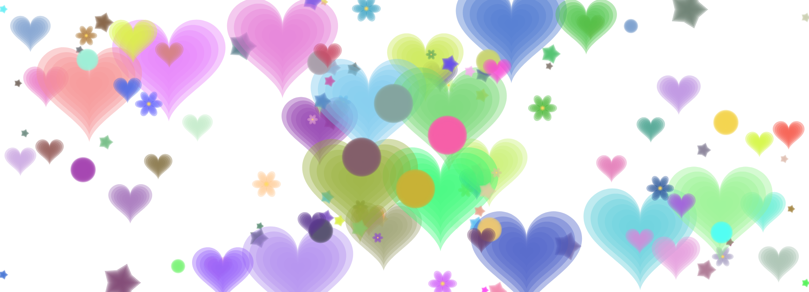

# カラージェネレーター (Color Generator)

子供から大人まで楽しめる、ブラウザ上で動作するインタラクティブなお絵描きツールです。クリック＆ドラッグで美しい模様を作成できます。

## デモ

[GitHub Pagesでプレイする](https://hiroe28.github.io/002_colorgenerator/)

## 特徴

- **シンプルな操作**: マウスでクリック＆ドラッグするだけで模様が描けます
- **多彩な形状**: 円・星・ハート・花の4種類の形状が選べます
- **対称モード（万華鏡効果）**: 
  - なし: 通常の描画
  - 2分割: 左右対称
  - 4分割: 十字型に4方向に広がる
  - 8分割: 万華鏡のような8方向への広がり
- **カラーテーマ**: 
  - ランダム: 様々な色がランダムに
  - パステル: 優しい色合い
  - ビビッド: 鮮やかな色
  - モノクロ: 白黒のグラデーション
  - 虹色: 虹のような色の変化
- **インタラクティブな大きさ変化**: マウスの動きの速さに応じて図形の大きさが変わります
- **おまかせ生成**: ボタン一つでランダムな模様を自動生成
- **保存機能**: 作成した作品をPNG画像として保存できます

## 使い方

1. 好きな形状（まる・ほし・ハート・はな）を選択
2. カラーテーマを選択
3. 対称モードを選択（効果を確認したい場合は「?」ボタンで説明を表示）
4. キャンバス上でマウスをクリックまたはドラッグして模様を描く
5. 「おまかせ生成」ボタンでランダムな模様を自動生成
6. 「リセット」ボタンでキャンバスをクリア
7. 「保存する」ボタンで作品を画像として保存

## 技術的な詳細

- **フレームワーク**: [p5.js](https://p5js.org/)
- **プログラミング言語**: JavaScript、HTML、CSS
- **動作環境**: モダンブラウザ（Chrome、Firefox、Safari、Edge）での実行を推奨

## 開発背景

このプロジェクトは、子供たちが楽しみながらデジタルアートを作成できるツールとして開発されました。シンプルな操作で複雑で美しい模様が作れるよう設計されています。

## ライセンス

MIT License

## クレジット

- [p5.js](https://p5js.org/) - クリエイティブコーディングのためのJavaScriptライブラリ

---

楽しいお絵描きタイムをお過ごしください！🎨✨
