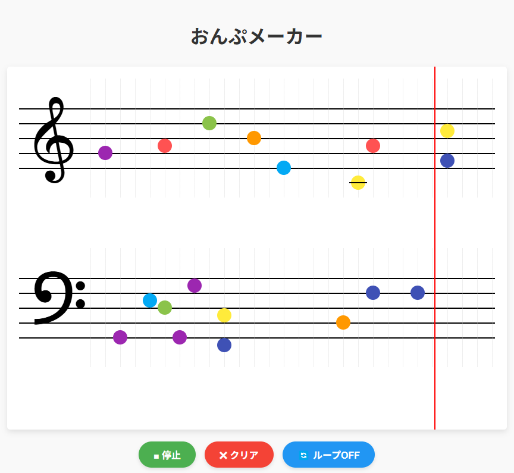

# おんぷメーカー



五線譜上に音符を置いて、メロディーを作って再生できるシンプルな音楽作成ツールです。

## 🎵 特徴

- ト音記号とヘ音記号の両方の五線譜に対応
- クリック一つで音符を追加・削除
- 作成したメロディーをすぐに再生
- ループ再生機能
- 直感的で使いやすいインターフェース
- 音符の配置位置に合わせて正確な音階を再生

## 💻 使い方

1. 「おんぷメーカーを開始する」ボタンを押して、アプリを起動します
2. 五線譜の好きな位置をクリックして、音符を追加します
3. 既存の音符をクリックすると削除できます
4. 「▶ 再生」ボタンを押すと、作成したメロディーが再生されます
5. 「🔄 ループOFF/ON」ボタンでループ再生の切り替えができます
6. 「✖ クリア」ボタンで全ての音符を消去できます

## 🔧 技術的な詳細

- HTML/CSS/JavaScriptで構築
- Tone.jsを使用して音声を生成
- モバイルデバイスにも対応したレスポンシブデザイン
- ブラウザ上で動作するため、インストール不要

## 🎓 教育利用について

「おんぷメーカー」は、以下のような場面での利用を想定しています：

- 音楽の基礎学習（五線譜や音階の理解）
- 簡単な作曲体験
- 子どもの音楽への興味を引き出す教材として
- 家庭での親子の音楽アクティビティ

## 🚀 使用開始

このツールは以下の方法で利用できます：

1. GitHubページを通じて直接アクセス: [おんぷメーカー](https://hiroe28.github.io/004_ompumaker/)
2. リポジトリをクローンして、`index.html`をブラウザで開く

```bash
git clone https://github.com/あなたのユーザー名/おんぷメーカー.git
cd おんぷメーカー
# ブラウザでindex.htmlを開く
```

## 📝 今後の予定

- 音符の長さ（全音符・2分音符・4分音符など）の選択機能
- 保存と読み込み機能
- 複数の楽器音色
- 作成した曲の共有機能

## ライセンス

MIT License

## 作者

Hiroe Matsuno
