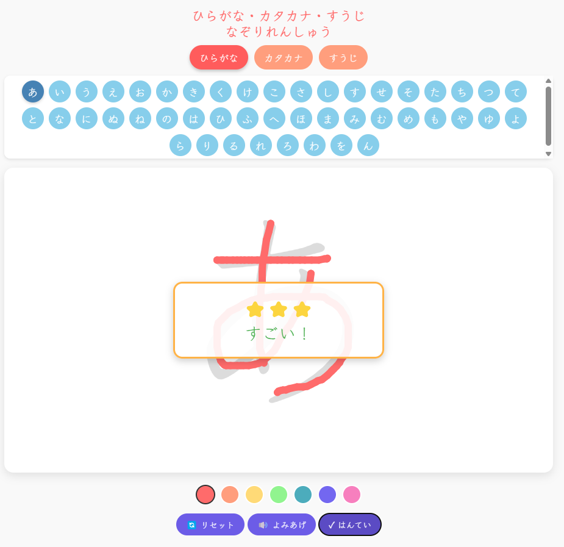

# ひらがな・カタカナ・数字なぞり練習アプリ

こども向けのひらがな・カタカナ・数字の書き方練習ができるシンプルなWebアプリです。タッチデバイス（スマートフォン・タブレット）に最適化されており、パソコンでもご利用いただけます。



## 機能

- ひらがな・カタカナ・数字の練習ができます
- お手本をなぞって書く練習ができます
- 書いた文字を判定して、フィードバックが表示されます
- 文字を選んでよみあげることができます
- カラフルなペンで書くことができます
- スマートフォン・タブレットでも快適に動作します

## 使い方

1. カテゴリ（ひらがな・カタカナ・すうじ）を選択
2. 練習したい文字をタップ
3. 薄く表示された文字をなぞって書く
4. 「はんてい」ボタンをタップして判定結果を確認
5. 「リセット」ボタンで書き直し
6. 「よみあげ」ボタンで文字を読み上げ

## 技術仕様

- HTML5, CSS3, JavaScript (ES6+)
- [p5.js](https://p5js.org/) - キャンバス描画ライブラリ
- Web Speech API - 音声読み上げ機能
- Web Audio API - フィードバック音声
- Klee One フォント (Google Fonts)

## デバイス対応

- モバイル: iOS 12+, Android 8.0+
- デスクトップ: 最新版のChrome, Firefox, Safari, Edge

## インストール方法

このアプリはブラウザベースのWebアプリケーションで、インストールは不要です。
GitHub Pagesで公開されているため、以下のURLから直接アクセスできます：

[https://hiroe28.github.io/007_mojiren/](https://hiroe28.github.io/007_mojiren/)

## オフライン利用について

ブラウザの「ホーム画面に追加」機能を使うことで、アプリをオフラインでも利用できます。

### iOS (iPhone/iPad)での手順:
1. Safariでアプリを開く
2. 画面下部の「共有」ボタンをタップ
3. 「ホーム画面に追加」を選択

### Android での手順:
1. Chromeでアプリを開く
2. メニューから「ホーム画面に追加」を選択

## ローカルでの開発・実行方法

1. リポジトリをクローン
```
git clone https://github.com/Hiroe28/007_mojiren.git
```

2. プロジェクトディレクトリへ移動
```
cd [リポジトリ名]
```

3. ローカルサーバーを立ち上げる（例：Python 3の場合）
```
python -m http.server
```

4. ブラウザで `http://localhost:8000` にアクセス

## カスタマイズ方法

- `sketch.js` - メインのアプリケーションロジック
- `style.css` - アプリケーションのスタイル設定
- `index.html` - HTMLレイアウト

### 新しい文字セットの追加

`sketch.js` ファイル内の `characters` オブジェクトを編集することで、新しい文字セットを追加できます。

```javascript
const characters = {
  hiragana: ['あ', 'い', ...],
  katakana: ['ア', 'イ', ...],
  numbers: ['0', '1', ...],
  // 新しいカテゴリを追加
  newCategory: ['文字1', '文字2', ...]
};
```

## ライセンス

MIT License

## 注意事項

- ブラウザの音声合成APIを使用しているため、一部の環境では読み上げ機能が動作しない場合があります。
- タッチ操作に最適化されていますが、マウス操作でも利用可能です。
- ブラウザの制限により、音声機能は最初のユーザー操作（タップやクリック）後に有効になります。

## プライバシーについて

- このアプリはユーザーデータを収集・保存しません
- すべての処理はユーザーのデバイス上で完結します
- 外部サーバーとの通信は行いません（GoogleフォントCDNを除く）

## サポート

質問やフィードバックがある場合は、GitHub Issuesでお問い合わせください。

---

作成：2025年