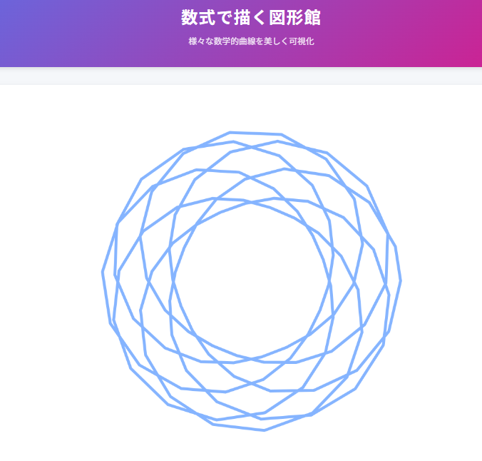

# 数式で描く図形館

数学的曲線の美しさを視覚的に体験できるWebアプリケーションです。ハート曲線、バラ曲線、レムニスケートなど、様々な数学的曲線を対話的に探索できます。

## 概要

このアプリケーションは、数学的な関数や方程式を視覚的な形で表現し、パラメータを調整することで形状を変化させる体験を提供します。教育目的での利用や、単純に数学的曲線の美しさを楽しむことができます。

## 特徴

- **15種類の数学的曲線**: 基本曲線から高度な曲線まで幅広い数式曲線を収録
- **インタラクティブな操作**: パラメータの調整によるリアルタイムな形状変化
- **アニメーション機能**: 曲線の動的な変化を観察可能
- **対称表示**: 1、2、4、8方向の対称パターンを表示
- **数式と説明**: 各曲線の数式と背景知識を表示
- **スマートフォン対応**: どのデバイスからでも快適に操作可能

## 収録曲線

### 基本曲線
- ハート曲線
- バラ曲線
- レムニスケート
- アルキメデス螺旋
- カージオイド

### 高度な曲線
- バタフライ曲線
- エピサイクロイド
- ハイポサイクロイド
- リマソン
- 対数螺旋

### その他の図形
- アステロイド
- サイクロイド
- トーラスノット
- 超楕円
- フォリウム

## 使い方

1. 曲線セクションから好みの曲線を選択します
2. パラメータA・Bを調整して形状を変更します
3. 対称性オプションで複数方向への表示を選択できます
4. アニメーションを有効にすると動的な表示になります
5. 数式表示をオンにすると、選択した曲線の数式と説明が表示されます
6. 作成した図形は「画像として保存」ボタンで保存できます

## 技術仕様

- HTML5 Canvas APIを使用した曲線描画
- JavaScriptによるリアルタイム計算と描画
- レスポンシブデザインによるマルチデバイス対応
- 純粋なHTML/CSS/JavaScriptのみで実装（外部ライブラリなし）

## ライセンス

MIT License

## 作者

Hiroe Matsuno

## 謝辞

数学的曲線の研究に貢献した多くの数学者たちに敬意を表します。