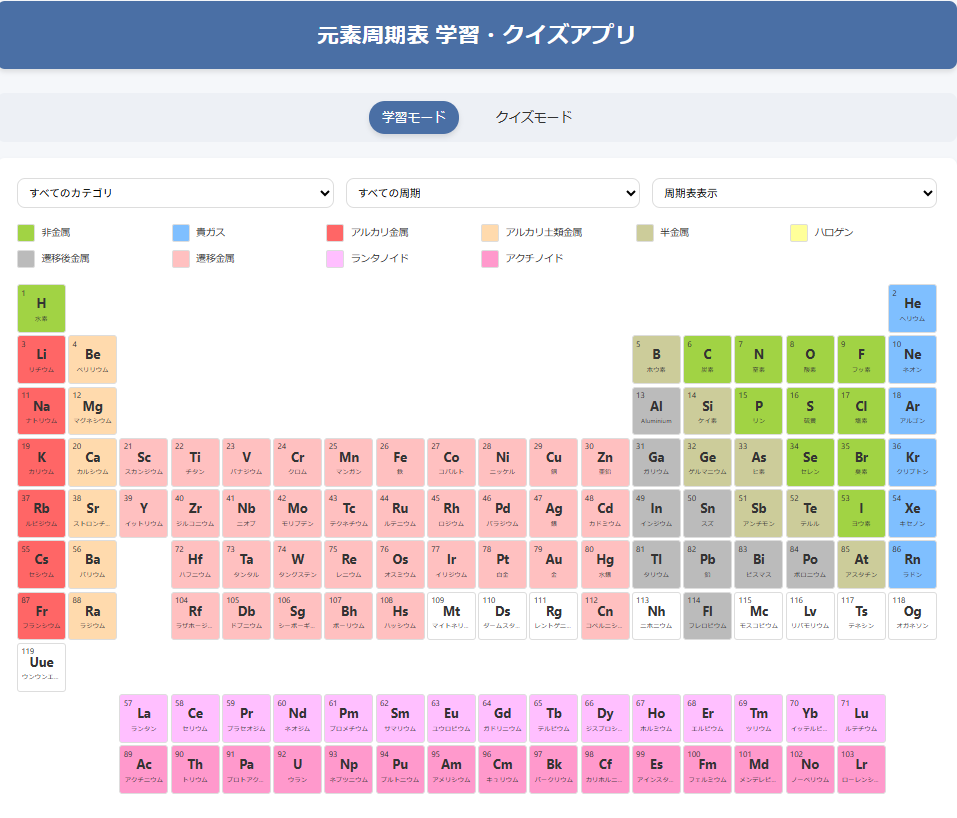

# 元素周期表 学習・クイズアプリ

元素の学習とクイズを楽しめる日本語対応の周期表アプリケーションです。

## 機能

- **学習モード**：元素をクリックして詳細情報を表示
  - 原子番号、原子量、分類、発見者など詳細情報の表示
  - 日本語の元素説明文
  - ボーアモデル画像表示
  - カテゴリや周期でのフィルタリング
  - 周期表表示/リスト表示の切り替え

- **クイズモード**：元素に関する知識をテスト
  - 元素記号→元素名
  - 元素名→元素記号
  - イメージ→元素名
  - 難易度設定：かんたん/ふつう/むずかしい
  - カテゴリ別クイズ

## 使用技術

- HTML5 / CSS3 / JavaScript
- [Periodic-Table-JSON](https://github.com/Bowserinator/Periodic-Table-JSON) - 元素データを提供
- レスポンシブデザイン - モバイル対応

## 始め方

1. このリポジトリをクローンまたはダウンロード
2. `index.html` をWebブラウザで開く

あるいは、[GitHub Pages](https://hiroe28.github.io/llm-100days-challenge/day016-periodic-table/index.html)で直接アクセスできます。

## データソース

このアプリケーションは、[Periodic-Table-JSON](https://github.com/Bowserinator/Periodic-Table-JSON)の元素データを使用しています。日本語の説明文は独自に作成しています。

## 対象ユーザー

- 化学を学ぶ学生・生徒
- 元素について学びたい子供たち
- 周期表の知識を復習したい方

## ライセンス

MIT

---

作成: 2025年  
100日間LLMチャレンジ - Day 16