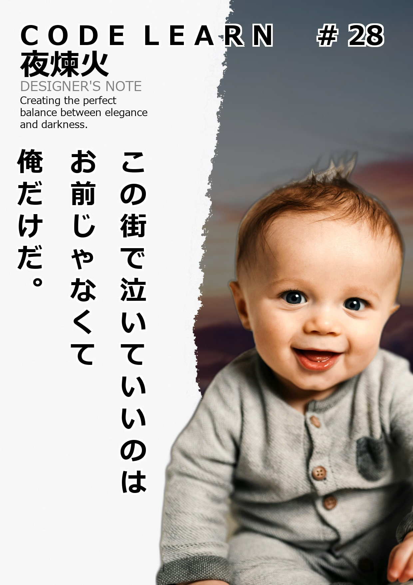

# VICE FAIRY風 画像ジェネレーター

## 🧚 プロジェクト概要

このアプリケーションは、VICE FAIRYのような雑誌風の画像を自動生成するStreamlitベースのツールです。人物画像をアップロードすると、背景を自動的に除去し、縦書きのキャッチコピーと洗練されたレイアウトを施した雑誌カバー風の画像を作成します。

## ✨ 主な機能

- 📸 人物画像の背景を自動除去
- 🖼️ 雑誌風レイアウトの自動生成
- 🔤 縦書きキャッチコピーの自動配置（CSVファイルから読み込み）
- 🎨 背景のカスタマイズ（ダークグレー背景/ローカル画像/アップロード画像）
- ✏️ タイトル・サブタイトルのカスタマイズ
- 🔢 雑誌号数の調整
- 🖨️ 複数の画質オプション（高品質/中品質/低品質）
- 💾 生成画像のダウンロード機能

## 📋 使い方

1. 人物画像をアップロード
2. 背景設定を選択（ダークグレー、ローカル背景画像、独自の背景をアップロード）
3. 号数、出力品質、テキストカスタマイズなどの設定を調整
4. 「作成！」ボタンをクリック
5. キャッチコピーや背景を変更して理想の画像に調整
6. 完成した画像をダウンロード

## 💻 技術仕様

- **使用言語**: Python
- **フレームワーク**: Streamlit
- **主要ライブラリ**:
  - PIL (Pillow): 画像処理
  - rembg: 背景除去
  - pandas: CSVファイル処理
  - pillow_heif: HEIC/HEIF形式サポート

## 🔧 インストール方法

```bash
pip install streamlit pandas pillow rembg pillow_heif
```

## 🚀 実行方法

```bash
streamlit run app.py
```

## 📁 ファイル構成

- `app.py`: メインアプリケーションコード
- `captions.csv`: キャッチコピーのデータファイル
- `template.png`: 破れた紙の効果を持つテンプレート画像
- `backgrounds/`: 背景画像を格納するディレクトリ

## 🎯 カスタマイズ

- `captions.csv` を編集して、独自のキャッチコピーを追加できます
- `backgrounds/` フォルダに画像を追加することで、背景選択肢を増やせます
- レイアウト設定は `FIXED_LAYOUT` 変数で調整可能

## 📝 注意事項

- 高品質設定では処理に時間がかかる場合があります
- 一部の画像では背景除去の精度が低下する場合があります
- 最適な結果を得るには、人物が明確に写っている画像を使用してください
- HEIC/HEIF形式のファイルにも対応していますが、環境によっては追加のセットアップが必要な場合があります

## 🌟 使用例

このアプリを使用して作成した画像例：



## 🔗 参考リンク

- [Streamlit公式ドキュメント](https://docs.streamlit.io/)
- [rembg (背景除去ライブラリ)](https://github.com/danielgatis/rembg)
- [Pillow (Python画像処理ライブラリ)](https://pillow.readthedocs.io/)

---

LLMアプリ100日チャレンジ - Day 21