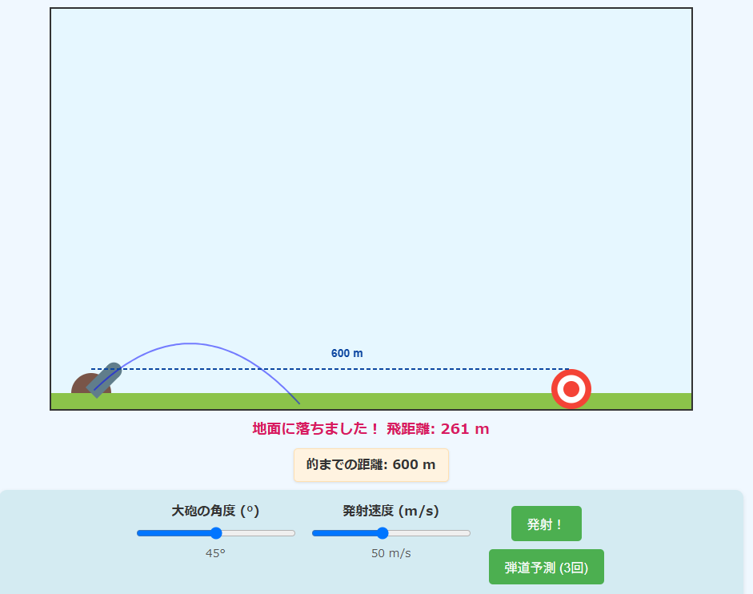

# シンプル大砲ゲーム - 物理学習版

## 概要

このWebアプリは、物理学の基本概念である「斜方投射」を楽しく学べる教育用ゲームです。大砲の角度と発射速度を調整して的を狙い、物理法則に基づいた放物線運動を体験できます。

## 機能

- 大砲の角度（0°～90°）と発射速度（10m/s～100m/s）を自由に調整
- リアルタイムの弾道シミュレーション
- 「学習モード」で物理の解説や理想的な角度・速度の計算を表示
- アチーブメントシステム（初めての命中、連続命中、最小速度での命中など）
- 的の位置を変更可能

## 学習内容

このゲームでは以下の物理概念を学ぶことができます：

- 斜方投射の基本原理と放物線運動
- 発射角度と飛距離の関係（45°で最大飛距離）
- 初速度と飛距離の二乗比例の関係
- 重力の影響

## 遊び方

1. 画面下部のスライダーで大砲の角度と発射速度を調整します
2. 「発射！」ボタンをクリックして大砲を撃ちます
3. 放物線を描く弾道を観察し、的に当てることを目指します
4. 「弾道予測」ボタンで発射前に軌道を確認できます（1ゲーム3回まで）
5. 画面上部に表示される的までの距離を参考にして狙いを定めましょう
6. 「学習モード」に切り替えると、物理の解説や理想的な設定値のヒントが表示されます

## 技術情報

- 純粋なHTML5、CSS3、JavaScript（フレームワーク不使用）
- Canvas APIを使用した描画とアニメーション
- リアルタイム物理計算による正確な弾道シミュレーション

## クレジット

このプロジェクトは [LLM 100 Days Challenge](https://github.com/hiroe28/llm-100days-challenge) の一部として作成されました。

## ライセンス

MIT License