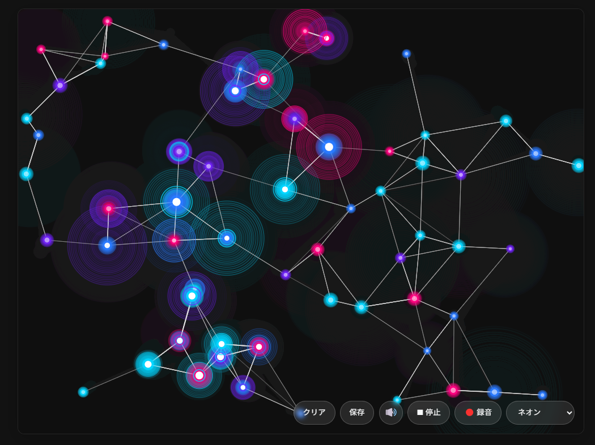

# ニューロンシンフォニー (Neuron Symphony)

## 概要

「ニューロンシンフォニー」は、脳内のニューロン（神経細胞）の活動パターンをモデルにした、インタラクティブなビジュアルアート＆音楽生成アプリです。画面をタッチやクリックすると、ニューロンが生成され、それらが相互に接続・反応しながら美しいパターンと音楽を奏でます。

## 特徴

- **インタラクティブなニューロン生成**: タッチやクリックでニューロンを配置し、自然に接続
- **美しい視覚効果**: ニューロンの発火パターンにより生まれる有機的な光の動き
- **自動演奏機能**: 配置したニューロンをもとにファンタジーゲーム風の音楽を自動生成
- **音楽録音機能**: 生成された音楽をWebM形式でダウンロード可能
- **物理的な挙動**: ニューロンは物理法則に従って動き、衝突や重力の影響を受ける
- **複数の色テーマ**: ネオン、パステル、オーシャン、ファイヤーの4種類のテーマから選択可能
- **スマートフォン対応**: タッチ操作や端末の傾きによる重力効果

## 使い方

1. 画面をクリック/タッチしてニューロンを配置します
   - クリックでニューロンを1つ追加
   - ダブルクリックで複数のニューロンを一度に追加
   
2. ニューロンが少なくとも10個以上配置されたら「自動演奏」ボタンをクリック
   - 配置したニューロンの位置や接続状態に基づいた音楽が生成されます
   - ニューロンが音楽に合わせて光ります
   
3. 音楽をダウンロードしたい場合は「録音」ボタンをクリック
   - 録音中は録音ボタンが赤く点滅します
   - 「録音停止」をクリックするとWebM形式の音声ファイルがダウンロードされます

4. その他の機能:
   - 「クリア」ボタン: すべてのニューロンを削除
   - 「保存」ボタン: 現在の画面をPNG画像として保存
   - 音量ボタン: 音をオン/オフ
   - テーマ選択: 4種類の色テーマから選択

## 技術的な解説

このアプリケーションは以下の技術を使用しています：

- **HTML5 Canvas**: ニューロンの視覚的な表現に使用
- **Web Audio API**: リアルタイムの音楽生成に使用
- **JavaScript**: ニューロンの振る舞いや物理シミュレーションに使用
- **MediaRecorder API**: 音楽の録音・ダウンロード機能に使用

### 音楽生成について

音楽生成エンジンはファイナルファンタジーやクロノ・クロスなどのRPGゲームの音楽風のクリスタルサウンドを生成します。音楽は配置したニューロンの位置とつながりに基づいて生成され、以下の要素が反映されます：

- ニューロンのX座標→音程
- ニューロンのY座標→オクターブ
- ニューロンの接続数→音量と重要度

## ブラウザ互換性

- 最新のChrome、Firefox、Safari、Edgeでの動作を確認しています
- 録音機能はMediaRecorder APIをサポートするブラウザでのみ使用可能です

## お子さまとの遊び方

お子さまと一緒に遊ぶことで、脳の仕組みについて話すきっかけになります。ニューロンはどうやって互いに「お話」するのかな？という問いから、楽しい学びが広がります。音楽が生まれる過程を視覚的に見ることで、音楽と色や形の関係性について考えるきっかけにもなります。

## クレジット

- デザイン・開発: [Your Name]
- インスピレーション: 脳神経科学、シナプス可塑性
- 音楽参考: ファイナルファンタジー、クロノ・クロスのサウンドトラック

---

© 2025 ニューロンシンフォニー | GitHub: [Hiroe28/llm-100days-challenge/day024-neuron-symphony]