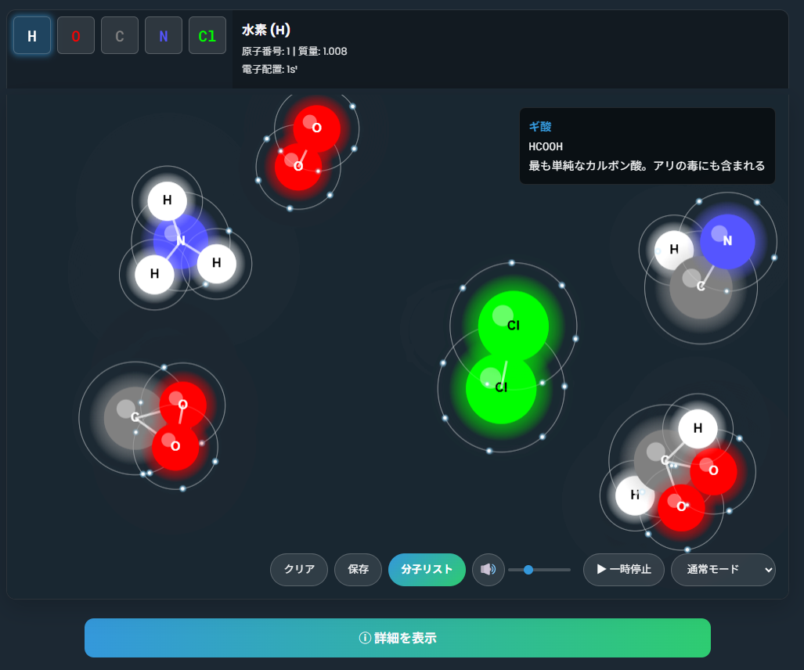

# アトミックプレイグラウンド (Atomic Playground)

## 📝 概要

**アトミックプレイグラウンド**は、化学の世界を直感的に体験できるインタラクティブなシミュレーションアプリです。タッチやクリックで原子を配置し、それらが互いに結合して様々な分子を形成する様子を観察できます。美しい視覚効果と音響効果を通じて、化学結合の基本的な概念を楽しく学ぶことができます。

このアプリは、特に子供たちに化学の魅力を伝えるための教育ツールとして、また化学に興味のある方の遊び場として開発されました。

## ✨ 特徴

- **直感的な操作**: タッチやクリックで簡単に原子を配置できます
- **リアルタイムシミュレーション**: 化学結合の物理法則に基づいた挙動をシミュレート
- **分子認識**: 一般的な分子（水、二酸化炭素、メタンなど）を自動的に認識して情報を表示
- **美しい視覚効果**: 原子と分子の結合を美しいグラフィックスで表現
- **インタラクティブなサウンド**: 原子の配置や分子の形成に合わせた音響フィードバック
- **モバイル対応**: スマートフォンやタブレットでも快適に使用可能（傾きによる重力効果も）
- **複数の元素**: 水素(H)、酸素(O)、炭素(C)、窒素(N)、塩素(Cl)の5種類の元素を使用可能
- **分子リスト**: 作成可能なすべての分子のリストを参照可能

## 🧪 作成可能な分子

アトミックプレイグラウンドでは、20種類以上の分子を作成できます：

- **単純な分子**: H₂O（水）、H₂（水素）、O₂（酸素）、N₂（窒素）、Cl₂（塩素）など
- **炭素化合物**: CH₄（メタン）、C₂H₆（エタン）、C₂H₄（エチレン）など  
- **アルコール類**: CH₃OH（メタノール）、C₂H₅OH（エタノール）
- **塩素化合物**: HCl（塩化水素）、CH₃Cl（クロロメタン）、CCl₄（四塩化炭素）など
- **窒素化合物**: NH₃（アンモニア）、NO（一酸化窒素）、NO₂（二酸化窒素）など
- **その他**: CO₂（二酸化炭素）、CO（一酸化炭素）、H₂O₂（過酸化水素）など

詳細は「分子リスト」ボタンをクリックして確認できます。

## 🎮 使い方

1. 上部の元素ボタン（H, O, C, N, Cl）から配置したい原子を選びます
2. キャンバスをタッチまたはクリックして原子を配置します
3. 原子は自動的に近くの原子と結合します（電気陰性度と結合能力に基づいて）
4. 既知の分子が形成されると、右上に分子情報が表示されます
5. 「分子リスト」ボタンをクリックすると、作成可能なすべての分子のリストを確認できます
6. 「クリア」ボタンでキャンバスをクリアし、「保存」ボタンで現在の状態を画像として保存できます
7. シミュレーションモードを切り替えて、熱運動や重力の効果を観察できます

**モバイルデバイスでの操作**:
- 画面をタップして原子を配置
- 原子を長押し（約1秒）すると、その原子を削除できます
- デバイスを傾けると、重力の方向が変わります

## 👨‍👩‍👧‍👦 お子さまと一緒に

このアプリは、親子で一緒に化学について学ぶための素晴らしいツールです：
- 「水素と酸素から水ができるのはなぜ？」といった基本的な質問から会話を始められます
- 分子の形成を視覚的に観察することで、化学結合の概念を理解しやすくなります
- 音響効果によって、分子形成の瞬間をより印象的に体験できます

## 🧠 技術的な詳細

アトミックプレイグラウンドは以下の技術を使用しています：

- **フロントエンド**: HTML5, CSS3, JavaScript（バニラJS）
- **グラフィック**: HTML5 Canvas
- **オーディオ**: Web Audio API
- **物理シミュレーション**: カスタム物理エンジン（電子間相互作用、化学結合エネルギーをモデル化）
- **レスポンシブデザイン**: モバイルとデスクトップの両方に対応

## 📋 技術的なレイアウト

- **index.html**: メインのHTMLファイル
- **styles.css**: スタイルシート
- **periodic_table.js**: 元素データと分子データベース
- **atom.js**: 原子クラスと物理シミュレーション
- **molecule.js**: 分子の検出と管理
- **audio.js**: サウンドシステム
- **app.js**: メインアプリケーションロジック

## 🔧 将来の展望

- さらに多くの元素と分子の追加
- 化学反応のアニメーションとシミュレーション
- ユーザーが作成した分子の保存機能
- 教育用のチュートリアルモード

## 📜 ライセンス

MIT License © 2025 Hiroe Matsuno

---

**Created as Day 25 of the [100 Days LLM App Challenge](https://github.com/Hiroe28/llm-100days-challenge)**