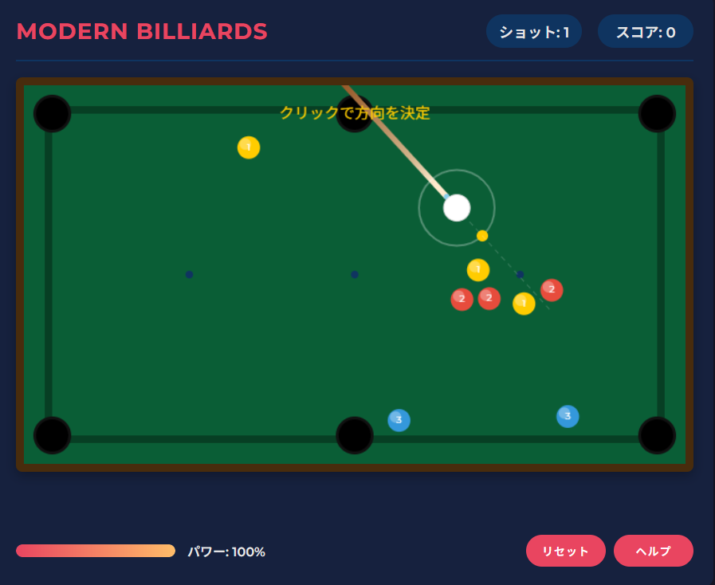

# モダンビリヤード (Modern Billiards)

## 概要

「モダンビリヤード」は、HTML5 Canvasを使用して作成された、シンプルながら楽しいビリヤードゲームです。スタイリッシュなデザインと直感的な操作性を兼ね備え、パソコンとスマートフォンの両方で遊べます。

## 特徴

- **美しいビジュアル**: ダークテーマをベースにしたモダンなデザイン
- **直感的な操作**: マウスまたはタッチで方向を決め、クリック/タップでショット
- **物理シミュレーション**: リアルな衝突と摩擦を再現
- **2つのゲームモード**: 
  - 練習モード: 1つの赤いボールで基本操作を練習
  - 標準モード: 複数のカラーボールでスコアを競う
- **スコアシステム**: 異なる色のボールで異なる得点
- **レスポンシブデザイン**: スマートフォンやタブレットに完全対応

## 遊び方

1. **方向の決め方**: マウスまたは指で白いボールから狙いたい方向に向かって動かし、クリック/タップで決定
2. **パワーの決め方**: パワーゲージが動いているときに、好みの強さでクリック/タップ
3. **ゲームの目的**: カラーボールをポケットに入れてスコアを獲得

### 得点システム
- 黄色のボール: 1点
- 赤いボール: 2点
- 青いボール: 3点
- 白いボールをポケットに落とすと1点減点

## 技術情報

- **フロントエンド**: HTML5, CSS3, JavaScript (ES6+)
- **レンダリング**: Canvas API
- **物理エンジン**: カスタム実装（衝突検出、運動量保存、摩擦など）
- **デザイン**: Flexbox, レスポンシブデザイン
- **フォント**: Google Fonts (Montserrat)

## 開発の動機

このゲームは、シンプルなUIとリッチなゲーム体験を両立させるチャレンジとして開発されました。特に物理シミュレーションとレスポンシブなデザインの実装に重点を置いています。また、ビリヤードというクラシックなゲームをモダンな解釈で再現することを目指しました。

## 将来の展望

- サウンドエフェクトの追加
- マルチプレイヤーモード
- より高度なAIの実装
- さまざまなテーブルデザインの追加

## ライセンス

MITライセンスの下で公開されています。

---

Day 26 of the #LLM100DaysChallenge  
