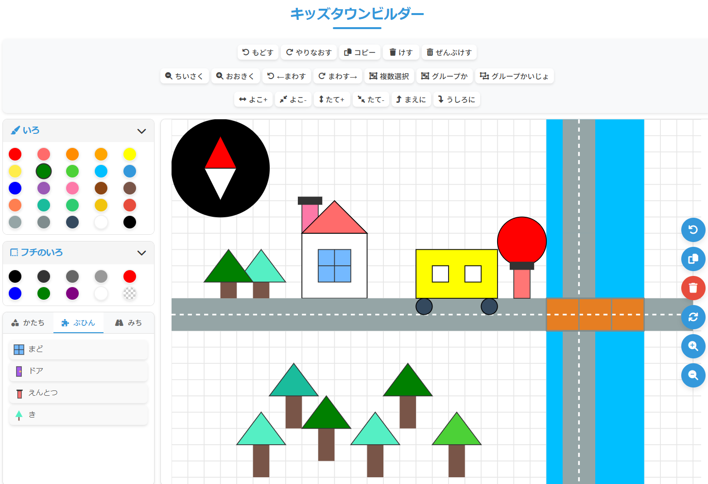

# キッズタウンビルダー - 子供向け町づくり図形エディタ

子供が直感的に操作できる図形エディタで、家や町を自由に作れるお絵かきアプリです。四角形や三角形などの基本図形に加え、窓やドアといった部品、道路などを組み合わせて、創造力を育みます。

## 特徴

- **シンプルな操作**: ドラッグ＆ドロップで図形を配置、移動
- **豊富な図形と部品**: 四角、三角、円などの基本図形に加え、窓、ドア、木などの部品や道路パーツを用意
- **簡単カスタマイズ**: 色の変更、サイズ調整、回転などが直感的に操作可能
- **便利な編集機能**:
  - コピー＆ペースト
  - グループ化・グループ解除
  - 前面・背面への移動
  - 履歴機能（元に戻す・やり直し）

## 使い方

1. **図形や部品の追加**:
   - 右側のパレットから「かたち」「ぶひん」「みち」のタブを選んで、使いたいものをクリック
   - クリックした図形がキャンバスの中央に追加されます

2. **図形の編集**:
   - **移動**: 図形をドラッグして移動
   - **選択**: 図形をクリックして選択（選択すると枠とハンドルが表示されます）
   - **サイズ変更**: 右下のハンドルをドラッグ、または「おおきく」「ちいさく」ボタンを使用
   - **回転**: 上のハンドルをドラッグ、または「まわす」ボタンを使用
   - **幅・高さ調整**: 右と下のハンドルをドラッグ、または「よこ+/-」「たて+/-」ボタンを使用

3. **色の変更**:
   - 図形を選択し、「いろ」パレットから好きな色をクリック
   - 「フチのいろ」パレットからフチの色も変更可能

4. **便利な機能**:
   - **コピー**: 図形を選択して「コピー」ボタンをクリック
   - **削除**: 図形を選択して「けす」ボタン、またはキーボードの Delete キー
   - **すべて削除**: 「ぜんぶけす」ボタン
   - **複数選択**: Shift キーを押しながら図形をクリック、または「複数選択」ボタンを使用
   - **グループ化**: 複数の図形を選択して「グループか」ボタン（Ctrl+G）
   - **グループ解除**: グループを選択して「グループかいじょ」ボタン（Ctrl+Shift+G）
   - **前面・背面移動**: 図形を選択して「まえに」「うしろに」ボタン
   - **元に戻す・やり直し**: 「もどす」「やりなおす」ボタン（Ctrl+Z, Ctrl+Y）

## こんなものが作れます

- かわいい家や建物
- 町並み
- 道路や公園のある風景
- 自由な想像の世界

## 操作方法

### キーボードショートカット

- **方向キー**: 選択した図形を移動
- **Delete**: 選択した図形を削除
- **Ctrl+Z**: 元に戻す
- **Ctrl+Y**: やり直し
- **Ctrl+G**: グループ化
- **Ctrl+Shift+G**: グループ解除
- **r / R**: 回転（右回り / 左回り）
- **+ / -**: 拡大 / 縮小
- **PageUp / PageDown**: 前面に / 背面に移動

### タッチ操作（スマートフォン・タブレット対応）

- **タップ**: 図形を選択
- **ドラッグ**: 図形を移動
- **長押し**: 複数選択モードの切り替え
- **ピンチ**: サイズ変更（一部のデバイスでは機能が制限される場合があります）

## 対象年齢

3歳以上の子供から大人まで、直感的な操作で楽しめます。

## 技術的特徴

- HTML5/CSS3/JavaScript で実装
- SVG を使った描画
- モバイルデバイス対応（タッチ操作サポート）
- レスポンシブデザイン

## 開発者向け情報

このアプリケーションは以下のファイル構造で構成されています：

- **index.html**: メインHTML
- **styles.css**: スタイル定義
- **js/config.js**: 設定パラメータ
- **js/main.js**: メインロジック
- **js/shapes.js**: 図形描画機能
- **js/controls.js**: 操作コントロール
- **js/history.js**: 履歴管理機能

---

楽しい創作タイムをお過ごしください！