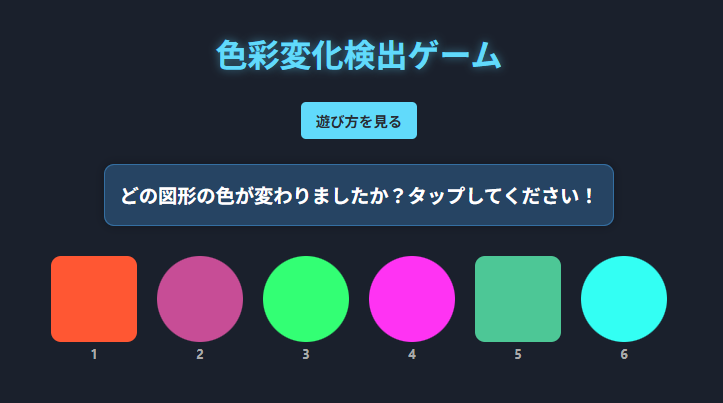

# 色彩変化検出ゲーム



「選択的注意」をトレーニングするための知覚ゲームです。表示された複数の色付き図形の中から、ゆっくりと色が変化する図形を見つけ出す能力を鍛えることができます。

## 🌟 特徴

- **視覚的注意力トレーニング**: 微妙な色彩変化を検出するスキルを向上
- **段階的な難易度**: 簡単なレベルから難しいレベルまで選択可能
- **視覚的フィードバック**: 色の変化を明確に表示し、学習を促進
- **レスポンシブデザイン**: スマートフォンからデスクトップまで様々なデバイスに対応
- **アクセシビリティ対応**: キーボードナビゲーションとスクリーンリーダーに対応

## 🎮 遊び方

1. 「スタート」ボタンを押すと、色付きの図形が表示されます
2. 図形の位置と色を覚えてください
3. 「まもなく色が変化します」という予告の後、1つの図形の色がゆっくりと変化します
4. 色の変化が終わったら、変化したと思う図形をタップしてください
5. 正解/不正解の結果が表示され、色の変化を確認できます
6. 「同じ問題に再挑戦」または「スタート」ボタンで新しい問題に挑戦できます

## 🧠 トレーニング効果

このゲームは以下の認知能力の向上に役立ちます：

- **選択的注意力**: 複数の視覚情報から特定の変化に焦点を当てる能力
- **視覚的作業記憶**: 色や形状の情報を短期的に記憶する能力
- **変化検出能力**: 微細な変化に気づく能力（変化の盲目性への対策）
- **持続的注意力**: 一定時間集中力を維持する能力

## 🔧 技術情報

このプロジェクトは以下の技術を使用しています：

- React.js: UIコンポーネントの構築
- CSS3: アニメーションと視覚効果
- JavaScript ES6+: 論理とインタラクティブ機能の実装

## 🚀 開発環境のセットアップ

```bash
# リポジトリをクローン
git clone https://github.com/yourusername/day30-color-change-game.git

# プロジェクトディレクトリに移動
cd day30-color-change-game

# 依存関係をインストール
npm install

# 開発サーバーを起動
npm start
```

ブラウザで [http://localhost:3000](http://localhost:3000) を開いてアプリを表示します。

## 📦 ビルドと配布

```bash
# 本番用ビルドを作成
npm run build
```

ビルドされたアプリは `build` フォルダに生成されます。本番環境にデプロイする準備が整っています。

## 📝 ライセンス

MIT

---

© 2025 LLM-100Days-Challenge. 選択的注意力向上のためのトレーニングツールとして開発されました。