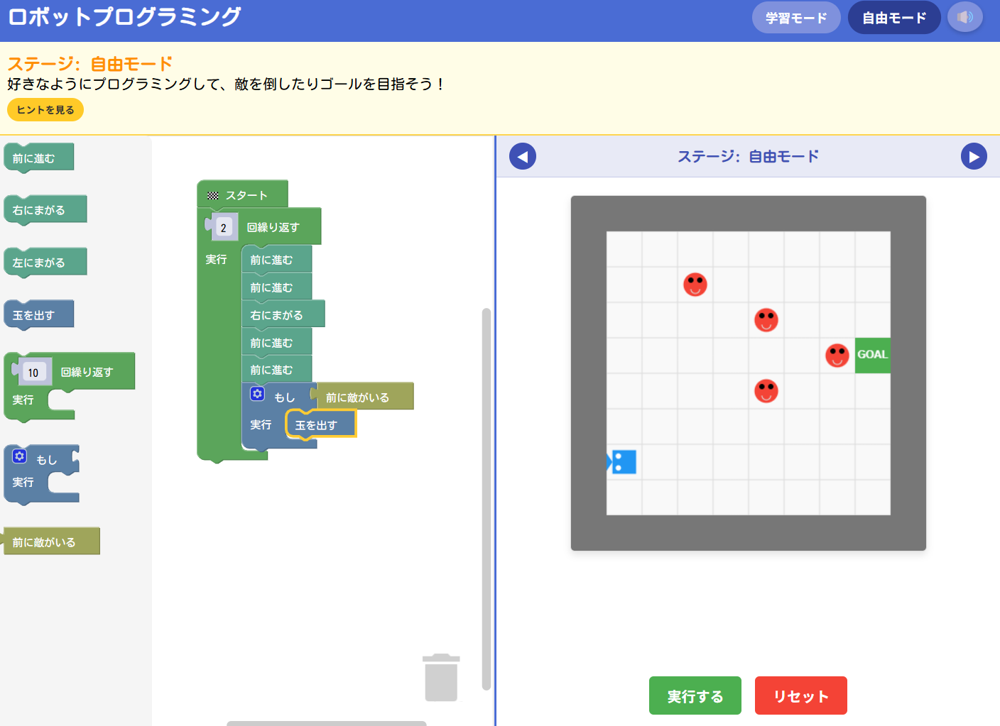

# ロボットプログラミング学習ゲーム

## 概要

「ロボットプログラミング」は、5歳以上の子どもがビジュアルプログラミングを楽しく学べるインタラクティブゲームです。Blocklyを使用した直感的なブロックベースのインターフェースで、プログラミングの基本概念を遊びながら習得できます。

## 主な機能

- **直感的なプログラミング**: ブロックをドラッグ＆ドロップするだけでプログラミングできます
- **段階的な学習**: 10段階のステージを通じて、基本から応用までステップバイステップで学びます
- **学習モードと自由モード**: 体系的に学ぶモードと自由に創造力を発揮するモードの両方を用意
- **リアルタイムフィードバック**: コードを実行するとロボットがリアルタイムで動き、即座にフィードバックが得られます
- **効果音**: 動作に合わせた効果音でよりゲーム性を高めています

## 学習できる概念

- **シーケンス**: 命令を順番に実行することを学びます
- **ループ**: 「繰り返し」ブロックで同じ動作を効率よく繰り返せます
- **条件分岐**: 「もし〇〇なら」で条件によって動作を変えられます
- **論理思考**: 迷路を解いたり、敵を倒したりするための論理的な戦略を考えます
- **デバッグ**: 思った通りに動かない場合、どこが間違っているかを特定して修正します

## ステージ構成

1. **はじめの一歩**: 前進の基本を学ぶ
2. **曲がる練習**: 右折を加えてより複雑な動きを作る
3. **左右に曲がる**: 左折も使った総合的な移動
4. **はじめての敵**: 玉を発射して敵を倒す
5. **くりかえし**: 繰り返し処理の基本
6. **くりかえしと方向転換**: 繰り返しを使ったより複雑な移動パターン
7. **くりかえしで敵を倒す**: 繰り返しと攻撃の組み合わせ
8. **もし〇〇なら**: 条件分岐の基本
9. **もし〇〇ならと繰り返し**: 条件分岐と繰り返しの組み合わせ
10. **総合力を試す**: 学んだすべてを活用する最終ステージ

## 技術スタック

- **フロントエンド**: HTML, CSS, JavaScript
- **ビジュアルプログラミング**: Blockly
- **サウンド**: Web Audio API
- **グラフィック**: Canvas API

## 使い方

1. Webブラウザで`index.html`を開きます
2. 左側のブロックをドラッグして中央のワークスペースに配置します
3. ブロックを組み合わせてプログラムを作ります
4. 「実行する」ボタンを押すとロボットが動きます
5. 「リセット」ボタンでやり直せます
6. ステージをクリアすると次のステージに進めます

## メンテナンス・バグ修正

バグに関する修正を含みます：
- Blocklyの初期化エラーを修正
- リサイジング時のエラーハンドリングを改善
- モバイル対応の強化

## ライセンス

このプロジェクトはオープンソースで、教育目的での自由な使用・改変を歓迎します。