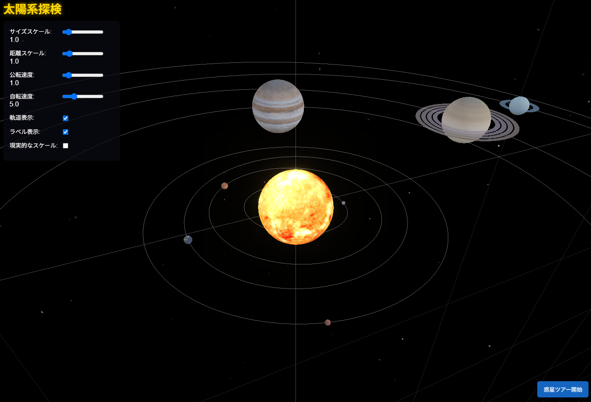

# 太陽系シミュレーション

## 概要

このプロジェクトは、Three.jsを使用した美しい3D太陽系シミュレーションです。実際の天文学的データに基づいて太陽と惑星の位置、サイズ、テクスチャを表現し、インタラクティブな宇宙探検体験を提供します。

## 機能

- **リアルなグラフィック**: 高品質なテクスチャと照明効果により、太陽系をレンダリング
- **惑星の自転と公転**: 実際の天文学的データに基づいた惑星の動き
- **インタラクティブな操作**: ドラッグでの回転、スクロールでのズーム、ダブルクリックでの中心移動
- **詳細な惑星情報**: 各惑星をクリックすると、名前、種類、公転周期などの詳細情報を表示
- **惑星ツアー機能**: 各惑星を順番に訪れるツアーモード
- **カスタマイズ可能**: 惑星のサイズ、距離、公転速度、自転速度を調整可能
- **表示オプション**: 惑星の軌道とラベルの表示/非表示

## 操作方法

- **移動・視点変更**: ドラッグで回転、スクロールでズーム
- **惑星情報表示**: 惑星をクリック
- **惑星にフォーカス**: 惑星をダブルクリック
- **惑星ツアー**: 「惑星ツアー開始」ボタンをクリック

## カスタマイズオプション

- **サイズスケール**: 惑星の相対的なサイズを調整
- **距離スケール**: 惑星間の距離を調整
- **公転速度**: シミュレーション全体の速度を調整
- **自転速度**: 惑星の自転速度を調整
- **現実的なスケール**: より正確な縮尺で表示（チェックボックス）

## 技術仕様

- **Three.js**: 3Dレンダリングエンジン
- **テクスチャ**: NASA提供の惑星テクスチャを使用
- **レスポンシブデザイン**: モバイルとデスクトップの両方に対応

## リソース

テクスチャは以下のソースから提供されています:
- [Solar System Scope](https://www.solarsystemscope.com/)
- [NASA](https://svs.gsfc.nasa.gov/gallery/background.html)

## 開発者向け情報

このプロジェクトは以下のファイル構造で構成されています:

- `index.html`: メインHTMLファイル
- `css/styles.css`: スタイルシート
- `js/main.js`: メインアプリケーションロジック
- `js/planetData.js`: 惑星データ
- `js/constants.js`: 定数と設定
- `js/utils.js`: ユーティリティ関数
- `textures/`: 惑星テクスチャ画像

## 作者

このプロジェクトは [LLM 100 Days Challenge](https://github.com/hiroe28/llm-100days-challenge) の一部として作成されました。