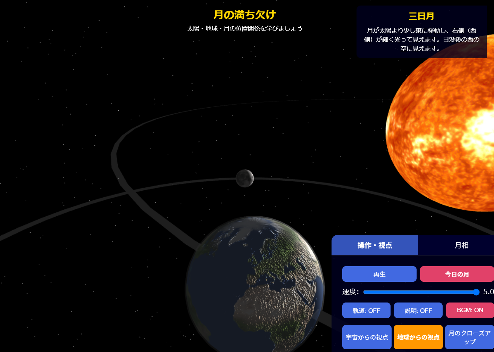

# 月の満ち欠け3Dシミュレーション



## 概要

太陽・地球・月の位置関係から月の満ち欠けの仕組みを学べる3Dシミュレーションです。様々な角度から月の満ち欠けを観察でき、宇宙・地球・月の3つの視点から見ることができます。

## 主な機能

- **月相の可視化**: 新月、三日月、上弦の月、十三夜月、満月、十六夜月、下弦の月、二十六夜月の8種類の月相を表示
- **今日の月**: 現在の日付に基づいた月齢と月相を表示
- **複数の視点**: 宇宙からの視点、地球からの視点、月のクローズアップの3つの視点を切り替え可能
- **インタラクティブな操作**: マウスやタッチ操作で自由に視点を変更可能
- **軌道表示**: 地球と月の軌道を表示/非表示
- **アニメーション**: 月の公転をアニメーションで表示、速度調整可能
- **レスポンシブデザイン**: PCとスマートフォン両方に最適化されたUI

## 使い方

1. **月相の選択**: 「月相」タブから各種月相（新月、三日月など）を選択できます
2. **今日の月**: 「今日の月」ボタンを押すと、今日の日付の月相と月齢が表示されます
3. **視点切替**: 「宇宙からの視点」「地球からの視点」「月のクローズアップ」ボタンで視点を切り替えられます
4. **アニメーション**: 「再生」ボタンで月の公転アニメーションを開始/停止できます
5. **速度調整**: スライダーでアニメーションの速度を調整できます
6. **軌道表示**: 「軌道: ON/OFF」ボタンで軌道の表示/非表示を切り替えられます
7. **説明表示**: 「説明: ON/OFF」ボタンで月相の説明文の表示/非表示を切り替えられます

## 技術仕様

- **3D描画**: Three.js (r128)
- **UI**: HTML5, CSS3, JavaScript
- **レスポンシブデザイン**: メディアクエリによるスマートフォン対応
- **天体テクスチャ**: 太陽、地球、月の高解像度テクスチャを使用

## OGP設定例

```html
<!-- OGP (Open Graph Protocol) -->
<meta property="og:title" content="月の満ち欠け3Dシミュレーション" />
<meta property="og:description" content="太陽・地球・月の位置関係から月の満ち欠けの仕組みを学べる3Dシミュレーション。様々な角度から月の満ち欠けを観察できます。" />
<meta property="og:image" content="https://hiroe28.github.io/llm-100days-challenge/day033-moon-system-3d/screenshot.png" />
<meta property="og:url" content="https://hiroe28.github.io/llm-100days-challenge/day033-moon-system-3d/index.html" />
<meta property="og:type" content="website" />

<!-- Twitter Card -->
<meta name="twitter:card" content="summary_large_image" />
<meta name="twitter:title" content="月の満ち欠け3Dシミュレーション" />
<meta name="twitter:description" content="太陽・地球・月の位置関係から月の満ち欠けの仕組みを学べる3Dシミュレーション。宇宙・地球・月の3つの視点から観察できるインタラクティブ教材。" />
<meta name="twitter:image" content="https://hiroe28.github.io/llm-100days-challenge/day033-moon-system-3d/screenshot.png" />
```

## 100日クリエイティブコーディングチャレンジ用カード例

```html
<!-- Day 33 -->
<div class="app-card" onclick="openApp('day033-moon-system-3d/index.html')">
    <div class="app-icon">🌓</div>
    <div class="app-title">月の満ち欠け3Dシミュレーション</div>
    <div class="app-description">太陽・地球・月の位置関係から月の満ち欠けの仕組みを学べる3Dシミュレーション。今日の月齢表示や宇宙/地球/月の3視点切替、軌道表示など多彩な機能で月の満ち欠けを体験。</div>
    <div class="app-day">Day 33</div>
</div>
```

## ファイル構成

- `index.html` - メインHTMLファイル
- `styles.css` - スタイルシート
- `main.js` - メインJavaScriptファイル（初期化、アニメーション、UI制御）
- `moonPhases.js` - 月相データと月齢計算
- `celestialBodies.js` - 天体作成と軌道設定
- `sun.jpg`, `sun_bump.jpg` - 太陽のテクスチャ
- `earth.jpg`, `earth_bump.jpg` - 地球のテクスチャ
- `moon.jpg`, `moon_bump.jpg` - 月のテクスチャ
- `screenshot.png` - プレビュー画像

## クレジット

- 月齢計算アルゴリズム - 「計算した月齢は近似値であり、正確な天文計算とは若干異なる場合があります」
- 天体テクスチャ - オープンソースの天体テクスチャを使用