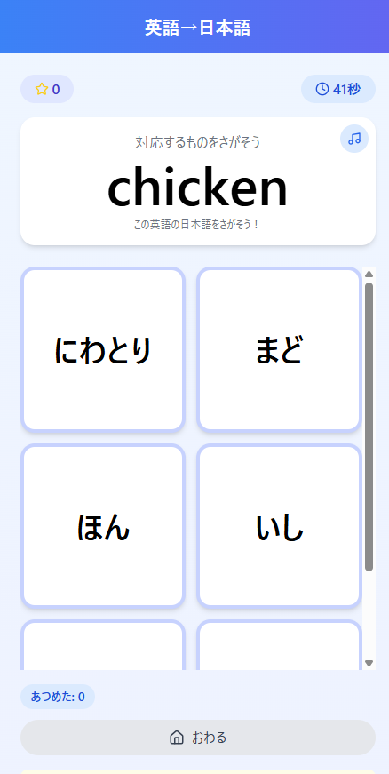

# もじつながり (Moji Tsunagari - Word Connection)



## 概要

「もじつながり」は、言語の対応関係を楽しく学べる教育用アプリです。ひらがな・カタカナの対応、漢字の読み方、日本語と英語の単語対応など、様々な言語要素の関連性を直感的に学習できます。

マッチングゲーム形式で学びながら点数を競えるため、子どもから大人まで楽しく言語学習を進められます。

## 機能

### 学習モード
- **にほんごモード**
  - ひらがな→カタカナ
  - カタカナ→ひらがな
  - 漢字→よみかた（1年生）
  - 漢字→よみかた（2年生）
  
- **えいごモード**
  - 英語→日本語
  - 日本語→英語

### ゲームタイプ
- **ふつう**：30秒間でたくさん集める
- **タイム**：20秒間の短時間集中チャレンジ
- **チャレンジ**：10個集めるとクリア

### 特徴
- 読み上げ機能搭載（日本語/英語対応）
- 直感的で使いやすいUI設計
- 連続正解でボーナスポイント
- ハイスコアの記録と保存
- レベルに応じた難易度調整
- キャラクターによる応援機能

## 開発技術

- React
- JavaScript
- Tailwind CSS
- Web Speech API

## 使い方

1. トップ画面で学習したいモードを選択します
2. ゲームタイプを選びます
3. 「はじめる」ボタンを押すとゲーム開始
4. 上部に表示される文字・単語に対応するものを下の選択肢から選びます
5. 制限時間内にできるだけ多く正解を集めましょう

## セットアップ

```bash
# 依存パッケージのインストール
npm install

# 開発サーバーの起動
npm start

# ビルド
npm run build
```

### 効果音の設定
以下のファイルを `public/sounds/` ディレクトリに配置してください：
- `correct.mp3` - 正解時の音
- `wrong.mp3` - 不正解時の音
- `gameover.mp3` - ゲーム終了時の音
- `highscore.mp3` - ハイスコア更新時の音
- `click.mp3` - ボタンクリック時の音

## 教育的効果

このアプリは以下の学習効果が期待できます：
- ひらがな・カタカナの対応関係の理解
- 漢字の読み方の習得
- 基本的な英単語と日本語の対応学習
- 反射神経とパターン認識能力の向上
- ゲーミフィケーションによる学習意欲の向上

## ライセンス

[MIT License](LICENSE)