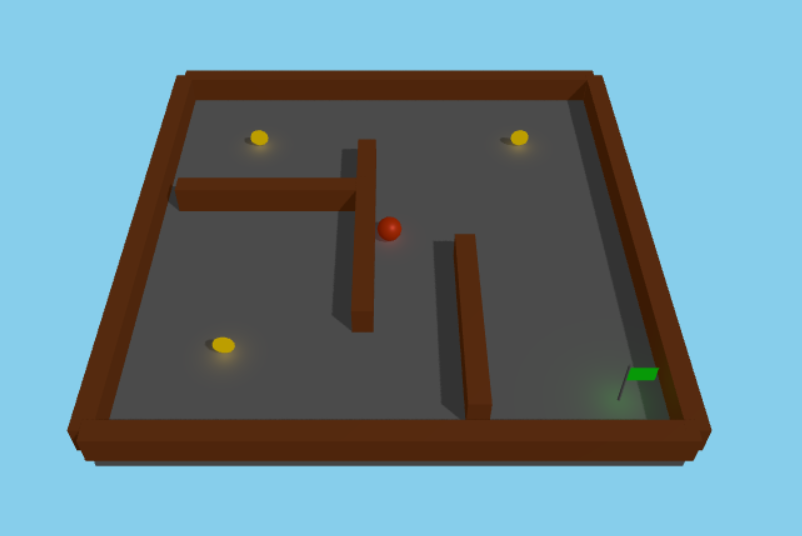

# ボールころがしパズル

## 概要
「ボールころがしパズル」は、画面をクリックまたはタップして3Dの迷路の中でボールを操作し、すべてのコインを集めてゴールを目指すゲームです。物理エンジンを活用した本格的な転がり感と、美しい3Dグラフィックスが特徴です。

## 遊び方
1. 画面をクリック/タップしてボールを転がす方向を指定します
2. 金色のコインをすべて集めてください
3. すべてのコインを集めたら、緑の旗（ゴール）に到達してレベルクリア！

## 特徴
- 物理エンジンを使用したリアルな転がり感
- レベルが進むにつれて複雑になる迷路
- 落とし穴や回転する障害物などの多様な要素
- スコアとタイマー表示によるやりがい
- 美しい3Dグラフィックスと光のエフェクト

## 技術的特徴
- Three.jsを使用した3Dグラフィックス
- Cannon.jsによる物理演算の実装
- レスポンシブデザインによるマルチデバイス対応
- ゲーム進行に合わせた効果音

## 開発背景
小さなお子さんから大人まで楽しめる、シンプルながらも奥深いゲーム体験を提供することを目指しました。クリック/タップ一つで直感的に操作でき、初心者でも簡単に遊べる設計になっています。

## 対応ブラウザ
- Chrome, Firefox, Safari, Edge (最新版推奨)
- モバイルブラウザ (iOS Safari, Android Chrome)

## 作者
LLM 100 Days Challenge - Day 035