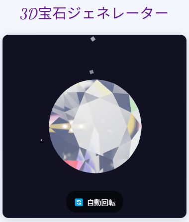

# 3D宝石ジェネレーター

## 概要
「3D宝石ジェネレーター」は、Three.jsを使用して作成された3Dの宝石をインタラクティブに生成・カスタマイズできるWebアプリケーションです。ダイヤモンド、ルビー、サファイア、エメラルドなど様々な宝石を、形状、色、輝き、透明度などのパラメータを調整してカスタマイズできます。

## 特徴
- **リアルな3D宝石表示**: Three.jsを活用した高品質な3Dレンダリング
- **9種類の宝石形状**: ラウンド、オーバル、プリンセス、ペア、マーキース、ハート、トリリオン、ラディアント、エメラルドカット
- **高度なカスタマイズ**: 色、光沢、透明度、屈折率、輝きの強さなど様々なパラメータを調整可能
- **プリセット機能**: よく知られた宝石（ダイヤモンド、ルビー、サファイア、エメラルドなど）の設定をワンクリックで適用
- **誕生石ガイド**: 月ごとの誕生石と意味を表示、相応の設定を自動適用
- **設定の保存と読み込み**: お気に入りの宝石設定を保存・再利用可能
- **画像としての保存**: 作成した宝石をPNG画像として保存可能
- **レスポンシブデザイン**: スマートフォン、タブレット、デスクトップなど様々なデバイスに対応
- **スパークルエフェクト**: 宝石の輝きをリアルに表現する特殊効果

## 使い方
1. 宝石の形状をドロップダウンメニューから選択
2. カラーピッカーまたはプリセットパレットから宝石の色を選択
3. スライダーを使って輝きの強さ、光沢、透明度、屈折率を調整
4. 「誕生石」タブで誕生月を選ぶと、対応する宝石の設定が適用され、その意味が表示されます
5. プリセットボタン（ダイヤモンド、ルビーなど）をクリックすると、典型的な宝石の設定が適用されます
6. 「自動回転」ボタンをクリックすると、宝石が自動的に回転します
7. 「画像保存」ボタンで現在の宝石の画像を保存できます
8. 「設定保存」と「設定読込」ボタンで宝石の設定を保存・復元できます

## 技術的詳細
- **フロントエンド**: HTML5, CSS3, JavaScript (ES6)
- **3Dレンダリング**: Three.js
- **3Dモデル**: OBJファイル形式の宝石モデル
- **データ保存**: localStorage
- **レスポンシブデザイン**: フレキシブルレイアウトとCSSグリッド
- **パフォーマンス最適化**: モバイルデバイス向けのレンダリング設定調整

## 今後の展望
- より多くの宝石の形状とタイプ
- 複数の宝石を組み合わせたジュエリーデザイン機能
- カスタム背景や環境設定
- 宝石の物理的特性に基づくさらにリアルなシミュレーション
- AR（拡張現実）対応による実世界での表示

## 作者
これは「LLMと100日間コーディングチャレンジ」の37日目のプロジェクトです。

## ライセンス
MIT License