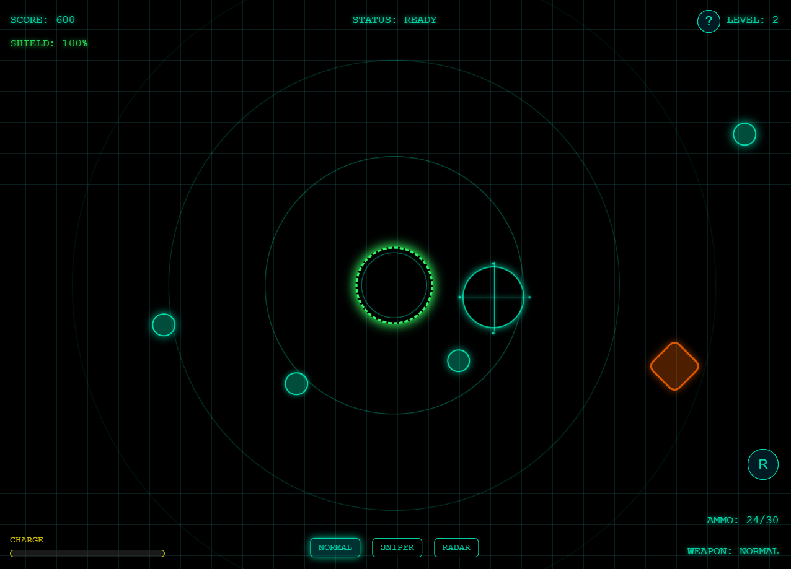

# サイバーディフェンス (Cyberfense)

## 概要

サイバーディフェンスは、サイバー空間を舞台にした防衛シューティングゲームです。画面中央に向かって迫りくる様々な敵を、3種類の武器を駆使して撃退します。敵のタイプによって効果的な武器が異なるため、状況に応じた戦略的な武器選択が勝利の鍵となります。

## 特徴

- **3種類の武器システム**: 通常、スナイパー、レーダーの3種類の武器を状況に応じて切り替え
- **敵の種類**: バイト型、ブロック型、クラスター型、ファイアウォール型、ボスと5種類の敵
- **レベルシステム**: スコアを獲得してレベルアップ、5レベルごとにボス出現
- **戦略性**: 敵のタイプによって効果的な武器が異なる（例：スナイパーはブロック型に効果的）
- **モバイル対応**: スマートフォンでもプレイ可能

## 操作方法

### PC
- **マウス移動**: 照準を操作
- **クリック**: 発射
- **[1]/[2]/[3]キー**: 武器切り替え（通常/スナイパー/レーダー）
- **[R]または[4]キー**: リロード
- **[ESC]キー**: 一時停止

### モバイル
- **タッチ・スワイプ**: 照準を操作
- **タップ**: 発射
- **画面下部ボタン**: 武器切り替え
- **Rボタン**: リロード

## ゲームの目的

敵がシステム中央（画面中央）に到達する前に撃破し、できるだけ高いスコアを目指します。敵が中央に到達するとシールドが減少し、シールドが0になるとゲームオーバーです。

## 武器と敵の相性

| 武器 | 効果的な敵 |
|------|------------|
| 通常 | バイト型 |
| スナイパー | ブロック型 |
| レーダー | ファイアウォール型 |

## 難易度設定

ゲームにはEasy、Normal、Hardの3段階の難易度があります。難易度が上がるほど敵の体力や速度が上昇し、より高度な戦略が求められます。

## テクニック

- 敵がたくさん出てきたときはレーダー武器が効果的
- ボス戦前にシールドを回復しておくと有利
- 弾切れに注意し、敵が少ないタイミングでリロード
- 効果的な武器で敵を撃破すると倍率がかかりポイントが高い

## クレジット

- プログラミング: Claude (Anthropic)
- デザイン: Claude with assistance from human
- 音楽・効果音: 魔王魂・効果音ラボ

## ライセンス

MIT License