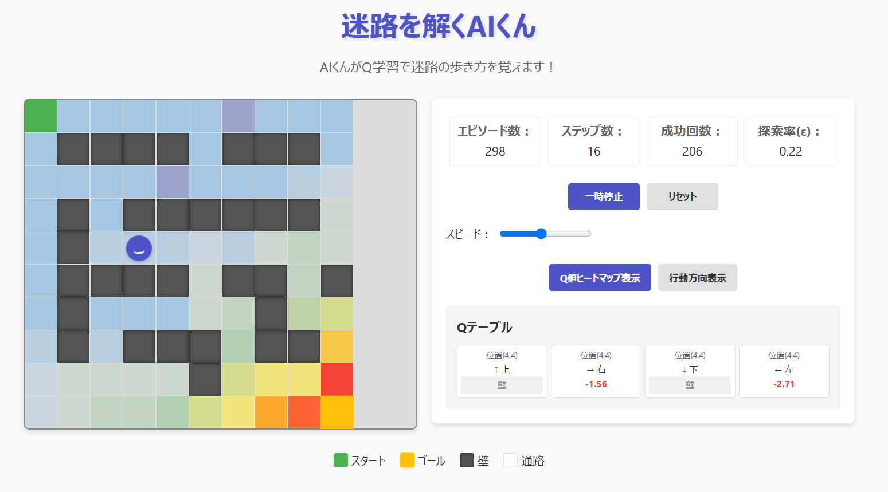

# 迷路を解くAIくん



## 📑 概要

「迷路を解くAIくん」は、強化学習（Q学習）を視覚的に学べるインタラクティブなWebアプリケーションです。
AIキャラクターが試行錯誤しながら迷路を解く様子を観察することで、機械学習の基本概念を直感的に理解できます。

## ✨ 特徴

- 可愛いAIキャラクターが迷路を探索・学習
- Q学習アルゴリズムによる強化学習プロセスの可視化
- 探索率(ε)の減衰により、探索から活用へ移行する様子を確認
- ヒートマップとベクトル矢印で学習状況を視覚化
- 報酬設計（距離ベースの報酬、ゴール報酬、ペナルティ）
- Q値テーブルのリアルタイム表示
- スマホ対応のレスポンシブデザイン

## 🧠 Q学習の仕組み

Q学習は強化学習の一種で、「状態」と「行動」の組み合わせに対する価値（Q値）を学習していきます：

1. **状態**: 迷路内の位置（座標）
2. **行動**: 上・右・下・左への移動
3. **報酬**: 
   - 基本移動: -1.0
   - ゴールに近づく: +0.5
   - ゴールから遠ざかる: -0.5
   - ゴール到達: +50
   - 失敗時（時間切れ）: -20

Q値の更新は以下の式で行われます：
```
Q(s,a) = Q(s,a) + α[r + γ・max(Q(s',a')) - Q(s,a)]
```
- α（学習率）= 0.1：新しい情報の反映度合い
- γ（割引率）= 0.9：将来の報酬の重要度

## 🎮 使い方

1. 「スタート」ボタンをクリックして学習を開始
2. AIくんが迷路内を探索しながら学習する様子を観察
3. スピードスライダーで学習速度を調整
4. 「Q値ヒートマップ表示」または「行動方向表示」ボタンで可視化方法を切り替え
5. 「リセット」ボタンでQ値をゼロに戻して最初からやり直し

## 🔧 実装のポイント

- **探索率(ε)の減衰**: 学習初期は探索重視（ε=1.0）から、徐々に知識の活用（最小ε=0.05）へ
- **マンハッタン距離による報酬設計**: ゴールへの距離に基づき、効率的な経路を学習
- **視覚的フィードバック**: 
  - ヒートマップ: 正の値（緑→赤）と負の値（青→紫）で表現
  - 矢印: 濃さ（Q値の大きさ）と色（正/負）で行動の良さを表現
- **エピソード終了条件の工夫**: 最良記録の2倍以上のステップ数を使った場合も終了

## 📚 学習教材として

このアプリは、強化学習の基本概念を視覚的に理解するための教育ツールとして設計されています。特に以下の概念を学べます：

- 探索（Exploration）と活用（Exploitation）のバランス
- 報酬設計と方策（Policy）の関係
- 価値関数に基づく意思決定
- 学習の収束過程

## 🛠️ 技術仕様

- JavaScript (ES6+)
- HTML5 & CSS3
- フレームワーク不使用の軽量設計
- GitHub Pages対応（サーバーサイド処理なし）

## 📱 対応デバイス

- デスクトップPC
- タブレット
- スマートフォン（レスポンシブデザイン）

---

強化学習の面白さを体験し、AIの学習プロセスを直感的に理解することができるアプリです。