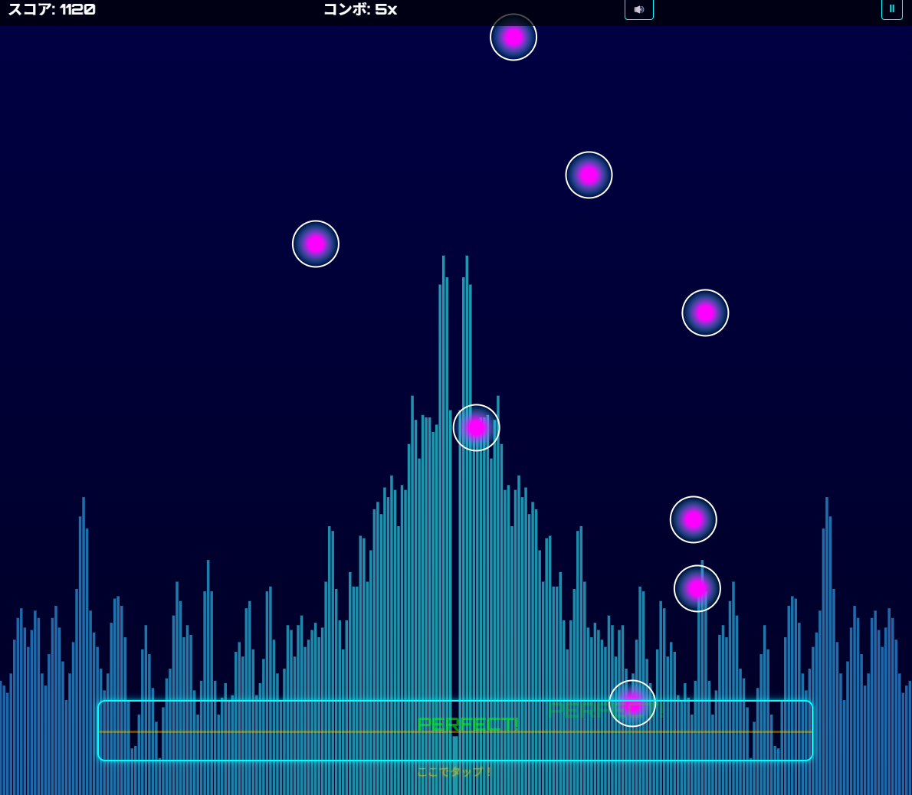

# ビートファクトリー - 音楽リズムゲーム

お手持ちの音楽ファイルを使って遊べるブラウザベースのリズムゲームです。音楽のビートに合わせて落ちてくるノーツをタイミングよくタップしましょう！

## 機能

- **自分の音楽でプレイ**: お好きな音楽ファイルをアップロードしてゲームをカスタマイズ
- **自動ノート生成**: アップロードした音楽を解析して自動的にノートを生成
- **3段階の難易度**: かんたん、ふつう、むずかしいから選択可能
- **3種類のビジュアライザー**: ネオン、オーシャン、レインボーのスタイルを選択可能
- **リアルタイム音楽視覚化**: 音楽に合わせて動くダイナミックなビジュアライザー
- **スコアシステム**: パーフェクト/グッド/ミスの判定とコンボによるスコア計算
- **モバイル対応**: スマートフォンとPCの両方で快適にプレイ可能

## 遊び方

1. 難易度を選択（かんたん、ふつう、むずかしい）
2. ビジュアライザースタイルを選択（ネオン、オーシャン、レインボー）
3. 音楽ファイルをアップロードするか、サンプル曲を選択
4. 画面上部から落ちてくるノーツが青いヒットエリアに到達したらタイミングよくタップ/クリック
5. パーフェクト（最高）、グッド（良）、ミス（失敗）の判定でスコアが変化
6. コンボを繋げるとスコアボーナス獲得！

## 操作方法

- **スマートフォン**: 画面をタップ
- **PC**: スペースキーを押すかマウスでクリック
- **ポーズ**: 右上のポーズボタンをクリック

## 技術的な特徴

- **Web Audio API**: 音楽解析とビート検出
- **ダイナミックノート生成**: BPM（Beats Per Minute）を検出して最適なノートパターンを生成
- **キャンバスアニメーション**: 滑らかなノート落下とビジュアライザー表示
- **レスポンシブデザイン**: さまざまな画面サイズに対応

## 音楽

- **BGMer**：https://bgmer.net/