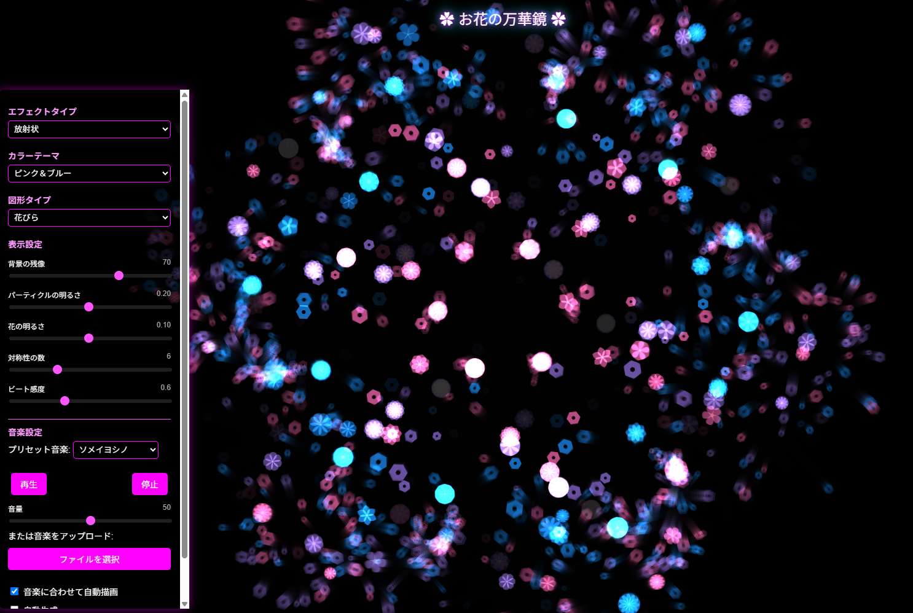

# 🌸 花と光の万華鏡 (Flower Kaleidoscope)

音楽のリズムに合わせて美しい花が咲き乱れる、インタラクティブな万華鏡アートを体験できるwebアプリケーションです。音楽と視覚効果が融合したデジタルアート作品です。

## ✨ 特徴

- **音楽に反応する花々**: ビートに合わせて花が咲き、パーティクルが舞い踊ります
- **自動描画モード**: 音楽に合わせて自動的に曲線を描き、万華鏡効果で幻想的なパターンを生成
- **対称万華鏡効果**: 設定可能な対称性により、複雑な幾何学模様を作成
- **4種類のエフェクト**: 放射状、渦巻き、波状、フローフィールドのパターン
- **美しいカラーテーマ**: パステル、ピンク＆ブルー、オレンジ＆パープル、ホットカラーから選択可能
- **タッチスクリーン対応**: スマートフォンやタブレットで直感的に操作可能
- **パラメーター調整**: 花の明るさ、背景の残像、ビート感度などを自由に調整

## 🎮 使い方

1. **音楽を選ぶ**: プリセット音楽から選択するか、お好みの音楽ファイルをアップロード
2. **再生ボタン**: 音楽を再生すると、自動的に花が音楽に反応し始めます
3. **画面操作**: 画面をクリックやタッチすることで、手動で花を咲かせることも可能
4. **設定変更**: 
   - カラーテーマを変更して雰囲気を変える
   - エフェクトタイプを切り替えて異なるパターンを楽しむ
   - 対称性の数を変更してより複雑な模様を作成
   - ビート感度を調整して音楽への反応度を最適化

## 🧪 テクニカル情報

- **使用技術**: HTML5, CSS3, JavaScript, p5.js
- **オーディオ処理**: Web Audio API
- **ビート検出**: 周波数スペクトル分析によるリアルタイムビート検出
- **描画技術**: p5.jsを利用した加算合成レンダリング

## 💡 応用アイデア

- 子供のための音楽感覚育成ツールとして
- 瞑想やリラクゼーションの補助ツールとして
- パーティーやイベントでの視覚エフェクトとして
- 音楽制作者のためのビジュアライザーとして

## 🙏 クレジット

- p5.js: [https://p5js.org/](https://p5js.org/)
- Web Audio API: [MDN Web Audio API](https://developer.mozilla.org/en-US/docs/Web/API/Web_Audio_API)
- 音楽：GBMer：[BGMer](https://bgmer.net/)

---

LLM 100Days Challenge - Day 042