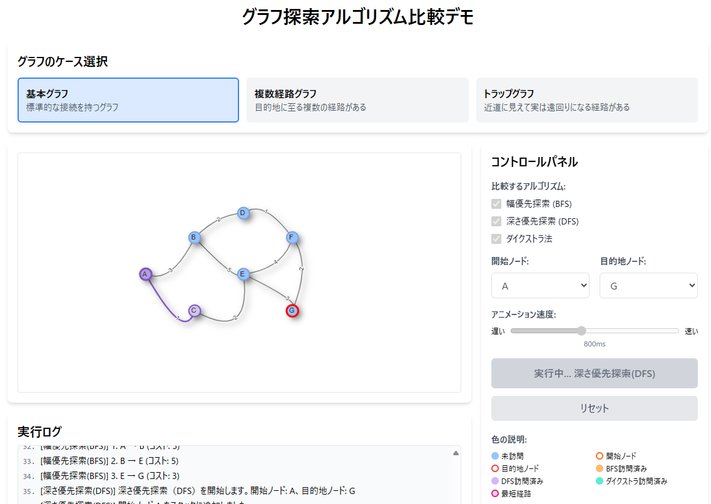

# グラフ探索アルゴリズム比較デモ

## 概要

このアプリケーションは、グラフ理論の基本的な探索アルゴリズムである「幅優先探索（BFS）」「深さ優先探索（DFS）」「ダイクストラ法」を視覚的に比較できるインタラクティブなデモツールです。リアルタイムのビジュアライゼーションと詳細なログで、各アルゴリズムの動作プロセスと特性の違いを学ぶことができます。

## 機能

- **3種類のアルゴリズムの比較**：BFS、DFS、ダイクストラ法の動作を視覚的に比較
- **4種類のグラフタイプ**：標準的なグラフ、迷路型グラフ、重み付きグラフ、密なグラフなど様々なタイプのグラフで検証可能
- **リアルタイム可視化**：ノードの訪問順序やエッジの探索過程をステップバイステップで表示
- **詳細なログ**：各ステップでの判断理由や状態変化を詳細に説明
- **比較モード**：全アルゴリズムを一度に実行し、性能や結果を比較
- **アニメーション速度調整**：学習ペースに合わせて表示スピードを調整可能
- **カスタマイズ**：開始ノードと目的地ノードを自由に選択可能

## 学習できる内容

- グラフ探索アルゴリズムの基本原理と動作の違い
- 各アルゴリズムが最適な場面とその理由
- キュー、スタック、優先度キューなどのデータ構造の使い方
- 各種グラフ構造での最短経路問題の解法
- エッジの重みが探索結果に与える影響

## 技術スタック

- React
- vis-network（グラフ可視化ライブラリ）
- Tailwind CSS（スタイリング）

## 使用方法

1. グラフタイプを選択
2. 開始ノードと目的地ノードを設定
3. 使用するアルゴリズムを選択
4. 「実行」ボタンをクリックし、ビジュアライゼーションとログを観察
5. 「全アルゴリズムを比較」ボタンで全てのアルゴリズムの結果を比較

## アルゴリズムの特徴

### 幅優先探索 (BFS)
- 開始ノードから近いノードから順に探索
- **キュー**を使用（先入れ先出し）
- 全ての辺の重みが等しい場合、最短経路を保証
- 常に最少ホップ数（エッジの数）の経路を見つける

### 深さ優先探索 (DFS)
- 1つの経路を最後まで探索してから別の経路を試す
- **スタック**を使用（後入れ先出し）
- 最短経路を保証しない
- メモリ使用量が少ない（現在の経路のみ保持）

### ダイクストラ法
- 各ステップで最も近いノードを選択
- **優先度キュー**を使用（距離でソート）
- 重み付きグラフでの最短経路を保証
- 全ての辺の重みが正の場合のみ使用可能

## 実際のアプリケーション例

- **BFS**: SNSの友達関係の探索、最短経路ナビゲーション（均一コスト）、ウェブクローリング
- **DFS**: パズル解法、迷路生成、トポロジカルソート、強連結成分の検出
- **ダイクストラ法**: カーナビゲーション（距離や時間を考慮）、ネットワークルーティング、スケジュール最適化

## デモページ

[グラフ探索アルゴリズム比較デモ](https://hiroe28.github.io/llm-100days-challenge/day043-graph-traversal/index.html)