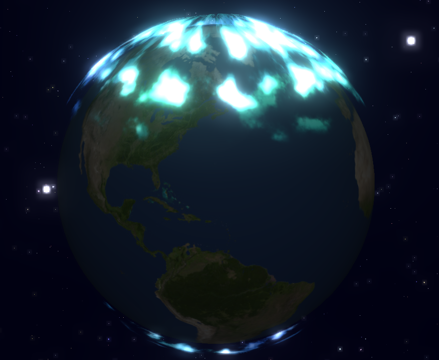

# オーロラワンダーランド

## 概要

オーロラワンダーランドは、親子で楽しめる3Dオーロラシミュレーションアプリです。美しいオーロラを地球上空に再現し、様々な視点から鑑賞できます。子どもも大人も楽しめるインタラクティブな体験を提供します。

## 特徴

- **美しいオーロラ表現**: 4種類のオーロラタイプ（グリーン、パープル、レッド、レインボー）を高品質なシェーダーで表現
- **インタラクティブな操作**: オーロラの明るさ、速さ、高さをリアルタイムで調整可能
- **複数の視点**: 北極、南極、全体ビューなど様々な角度からオーロラを鑑賞
- **キッズモード**: 子ども向けのカラフルなインターフェースと解説で、小さなお子様も楽しめる
- **写真撮影機能**: 美しいオーロラの瞬間を撮影して保存
- **オーロラスポット表示**: 実際にオーロラが観測できる世界の場所を地球上に表示
- **自然音BGM**: 癒しの環境音がさらに没入感を高める
- **マルチプラットフォーム対応**: PCからスマートフォンまで様々なデバイスで楽しめる

## 技術的な詳細

- **Three.js**: 3Dグラフィックスの描画に使用
- **WebGLシェーダー**: リアルなオーロラのアニメーションをGLSLシェーダーで実現
- **レスポンシブデザイン**: あらゆる画面サイズに最適化
- **ポストプロセッシング効果**: ブルーム効果などを活用し、発光感を表現

## 使い方

1. ページを開くと、3D地球とその上空のオーロラが表示されます
2. 右上のコントロールパネルでオーロラのタイプや設定を変更できます
3. 左側のカメラボタンで視点を切り替えられます
4. 右下のアクションボタンで写真撮影や全画面表示が可能です
5. 左下のキッズモードボタンで子ども向け表示に切り替えられます

## 開発者向け情報

このプロジェクトは以下のファイル構成になっています：

- `index.html`: メインのHTML構造
- `style.css`: スタイル定義
- `js/aurora.js`: オーロラシミュレーションのコア実装
- `js/controls.js`: UIと操作の実装
- `js/main.js`: アプリケーションのメインロジック

WebGLとThree.jsを使用しているため、モダンブラウザでの動作を推奨します。

## 今後の展望

- さらなるオーロラタイプの追加
- AR/VR対応によるさらなる没入感
- オーロラ発生のサイエンスについての詳細な教育コンテンツ
- 季節や時間に応じた星空の変化

## クレジット

- デザイン＆開発: LLM-100Days-Challenge
- Three.jsライブラリ: [three.js](https://threejs.org/)
- 参考資料: 各国の気象機関が公開しているオーロラデータ

## ライセンス

MIT License