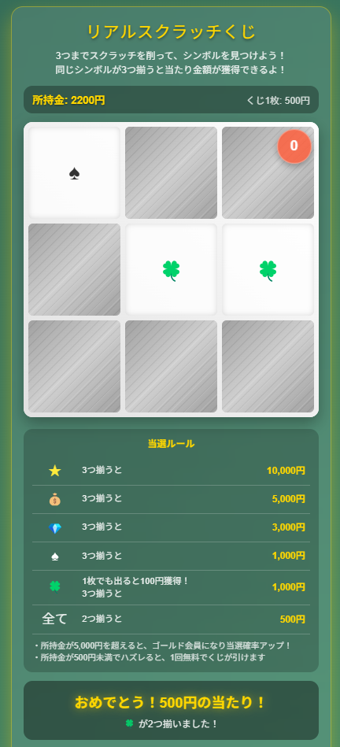

# リアルスクラッチくじ

## 概要

「リアルスクラッチくじ」は、実際のスクラッチくじの体験をブラウザで再現したインタラクティブなゲームです。スマートフォンやパソコンで本物のスクラッチくじのような感覚を楽しめます。画面上のくじをこすり、シンボルを揃えて賞金を獲得しましょう！

## 特徴

- **リアルなスクラッチ体験**: 指やマウスでこするとくじの表面が削れ、シンボルが現れます
- **わかりやすいルール**: 同じシンボルが揃うと当選！2つ揃っても当選する親切設計
- **多彩な当選パターン**: 3つ揃うと最大10,000円の高額当選も！
- **特殊シンボル**: 🍀は1枚出るだけで小当たり（100円）がもらえる特殊シンボル
- **リッチな視覚・音声効果**: 当選時の演出や効果音でワクワク感を演出
- **ゴールド会員システム**: 所持金が5,000円を超えるとゴールド会員になり、当選確率アップ
- **無料券システム**: 所持金が少なくなると無料券がもらえるチャンス

## 遊び方

1. 「次のくじを買う」ボタンをクリックしてゲームを開始します
2. 画面上のくじを指やマウスでこすると、下にあるシンボルが現れます
3. 最大3箇所までスクラッチできます（残り回数は右上に表示）
4. 同じシンボルが揃うと当選！当選金額が所持金に加算されます
5. 当選ルールはスクラッチ下に常時表示されています

## 当選ルール

- ★ × 3: 10,000円
- 💰 × 3: 5,000円
- 💎 × 3: 3,000円
- ♠ × 3: 1,000円
- 🍀 × 3: 1,000円
- 🍀 × 1: 100円 (小当たり)
- 全てのシンボル × 2: 500円

## 技術的詳細

- 純粋なHTML/CSS/JavaScriptで構築されており、追加ライブラリは不要
- Canvas APIを使用した本物のようなスクラッチ体験
- タッチデバイス（スマートフォンやタブレット）に完全対応
- レスポンシブデザインで様々な画面サイズに対応

## クレジット

- 開発: [あなたの名前]
- アイデア＆企画: LLM活用100日チャレンジ Day 045
- アシスタント: Claude (Anthropic)

## ライセンス

MIT License