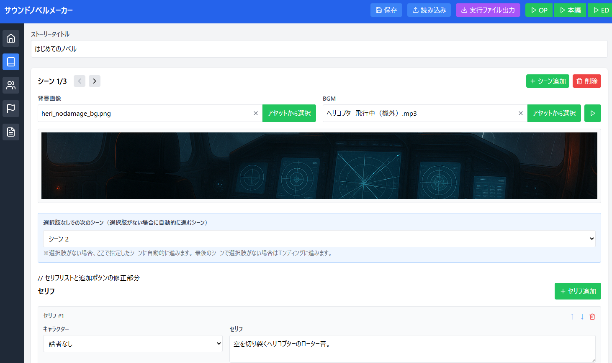

# サウンドノベルメーカー

オリジナルのサウンドノベル（ビジュアルノベル）を簡単に作成できるWebアプリケーションです。背景画像、キャラクター、BGM、効果音などをカスタマイズして、自分だけのストーリーを作りましょう。

## 🌟 主な機能

- **シーン編集**: 複数のシーンを作成し、ストーリーの流れを設計できます
- **キャラクター管理**: オリジナルキャラクターの設定と画像の設定が可能
- **視覚効果**: 背景のフェードイン/アウト、クロスフェードなどの演出
- **音声効果**: BGMの設定、クロスフェード、効果音の追加
- **分岐機能**: 選択肢を作成して物語に分岐を設定できます
- **プレビュー機能**: 作成中のノベルをいつでもプレビュー可能
- **オープニング/エンディング**: タイトル画面とエンディング画面をカスタマイズ
- **書き出し機能**: 完成したノベルをHTML形式でエクスポートし、ブラウザで遊べます

## 💻 使い方

1. **左側のタブメニュー**を使って、編集したい項目を選択します：
   - 🏠 **オープニング設定**: タイトル画面のカスタマイズ
   - 📚 **ストーリー**: セリフや選択肢、背景などの設定
   - 👥 **キャラクター**: キャラクターの作成と編集
   - 🚩 **エンディング設定**: エンディング画面のカスタマイズ
   - 📁 **アセット管理**: 画像や音声ファイルの管理

2. **ストーリー編集**では：
   - シーンを追加して物語の構成を作る
   - 各シーンにセリフを追加
   - 背景画像やBGMを設定
   - 必要に応じて選択肢を追加して分岐を作る

3. **プレビュー**：
   - 上部の「OP」「本編」「ED」ボタンから任意の場所からプレビュー開始
   - 実際のノベルゲームと同じ操作感で動作確認できます

4. **書き出し**：
   - 「実行ファイル出力」ボタンからHTMLファイルとして書き出し
   - 書き出したZIPファイルを解凍して、HTMLファイルを開くだけで遊べます

## 🔧 技術的な詳細

- **フロントエンド**: React、TailwindCSS
- **状態管理**: React Hooks (useState, useEffect, useRef)
- **アセット管理**: ローカルストレージとBlobURL
- **アニメーション**: CSSトランジションとJavaScriptタイマー
- **エクスポート**: JSZip、FileSaverを使用

## ✨ 実装上の特徴

- **モジュラー設計**: コンポーネントベースのアーキテクチャを採用
- **リアルタイムプレビュー**: 編集内容をすぐに確認できる
- **タイプライター効果**: テキストが1文字ずつ表示される演出
- **フェード効果**: 背景やシーン転換時のスムーズな視覚効果
- **クロスフェードBGM**: BGM切り替え時の自然な音声トランジション
- **アセット管理システム**: 画像や音声ファイルの効率的な管理

## 📝 ライセンス

このプロジェクトはMITライセンスの下で公開されています。商用・非商用問わず自由にご利用いただけますが、制作物にクレジット表記をしていただけると嬉しいです。

---

LLM 100 Days Challenge - Day 046