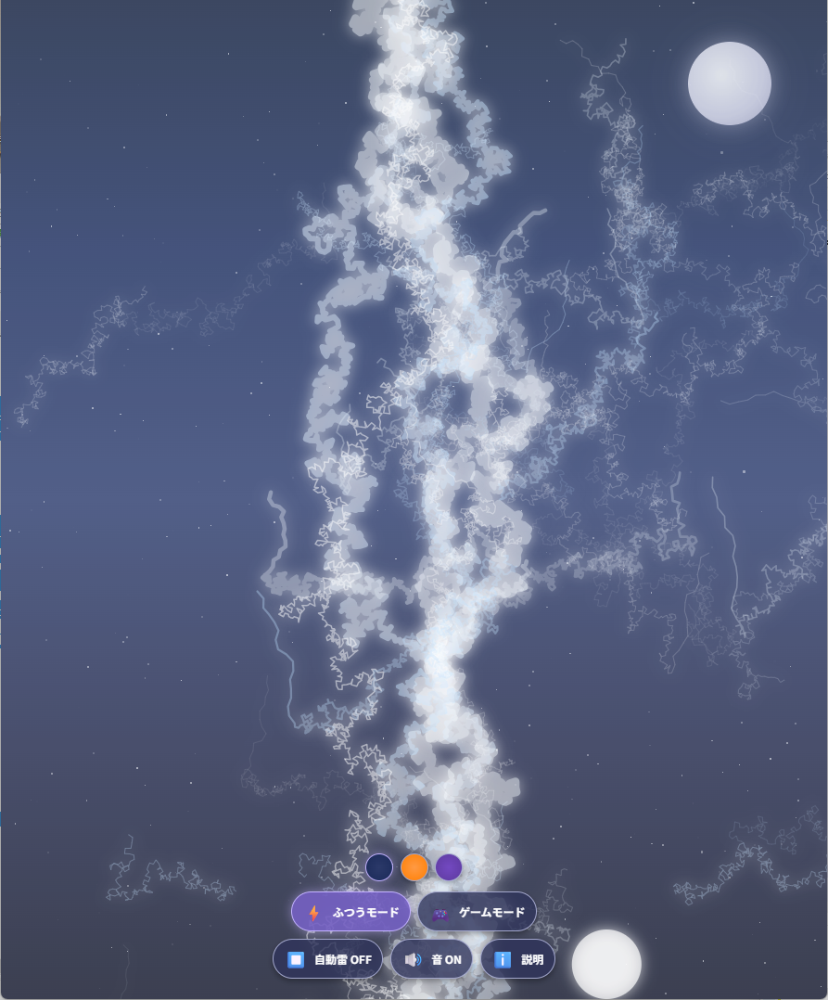

# 楽しい雷の世界 - インタラクティブ雷エフェクト＆ゲーム

インタラクティブな雷エフェクトとゲームを組み合わせたWebアプリケーションです。美しい雷のアニメーションを楽しみながら、ゲームモードでは素早さと反射神経が試されます。

## 機能

### 雷エフェクト
- リアルな物理ベースのアニメーション
- 枝分かれする自然な雷の動き
- 光のフラッシュと衝撃波エフェクト
- 雷鳴の音響効果

### テーマ設定
- 夜空モード - 青い雷と星空
- 夕焼けモード - オレンジの雷と夕焼け背景
- ファンタジーモード - 紫の雷と幻想的な背景

### プレイモード
- **ふつうモード**: 自由に雷を生成して楽しむモード
- **ゲームモード**: 制限時間内にターゲットを撃ち、スコアを稼ぐモード
  - 難易度設定：かんたん、ふつう、むずかしい
  - コンボシステム：連続ヒットでボーナススコア
  - レベルアップシステム：成功するとターゲットが小さく・速くなる

### その他機能
- 自動再生機能：リラクゼーション用に雷が自動的に生成
- サウンドON/OFF切り替え
- レスポンシブデザイン：スマートフォンやタブレットにも対応

## 遊び方

1. **ふつうモード**
   - 画面をタップ/クリックするだけで、その場所に雷が落ちます
   - テーマを変更すると、雷の色と背景が変わります
   - 自動再生ボタンをオンにすると、雷が自動的に生成されます

2. **ゲームモード**
   - 「ゲームスタート」ボタンを押してゲームを開始
   - 画面に表示されるターゲットをタップ/クリック
   - 連続でヒットさせるとコンボボーナスが発生
   - レベルが上がるとターゲットが小さく・素早く移動
   - 制限時間内にできるだけ高いスコアを目指そう！

## 技術的な詳細

- HTML5 / CSS3 / JavaScript
- SVGアニメーション（雷エフェクト）
- Web Audio API（サウンドエフェクト）
- レスポンシブウェブデザイン

## 開発の経緯

このプロジェクトは、視覚的に魅力的なインタラクティブコンテンツを作りながら、物理ベースのアニメーションとゲームメカニクスを実装する練習として開発しました。特に雷のランダムな枝分かれパターンの生成と、視覚効果と音響効果を組み合わせた没入感の創出にこだわっています。

---

LLM 100Days Challengeの一環として開発