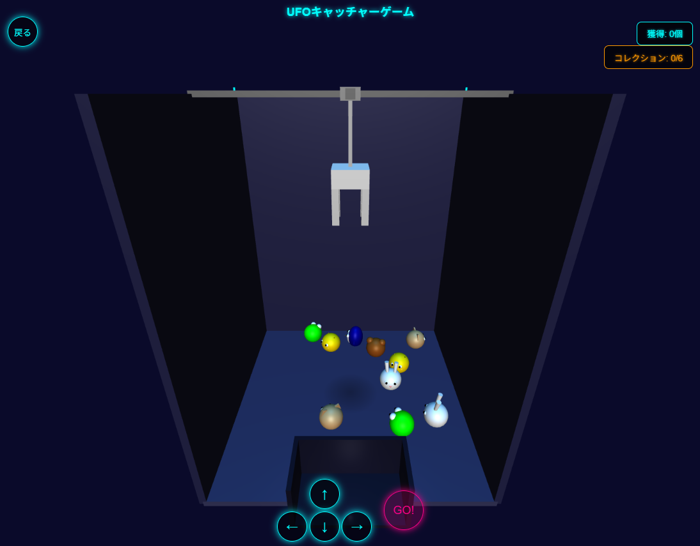

# UFOキャッチャーゲーム

## 概要
このプロジェクトは、ブラウザで遊べるUFOキャッチャー（クレーンゲーム）のシミュレーションです。Three.jsを使用した3Dゲームで、スマートフォンでもPCでも遊べるよう最適化されています。

## 特徴
- 6種類のかわいいキャラクターを集めるコレクション要素
- 「ふつうモード」と「むずかしいモード」の2つの難易度
- タッチスクリーン対応の直感的な操作
- 3D効果と物理的な動きのシミュレーション
- ゲーム音楽と効果音

## プレイ方法
1. ゲーム開始時に難易度を選択
2. 十字キー（または画面の矢印ボタン）でクレーンを移動
3. 「GO!」ボタン（またはスペースキー）でクレーンを下ろす
4. すべてのキャラクターをコレクションしてゲームクリアを目指す

## 技術仕様
- **フロントエンド**: HTML5, CSS3, JavaScript
- **3Dレンダリング**: Three.js
- **アニメーション**: GSAP (GreenSock Animation Platform)
- **レスポンシブデザイン**: モバイルとデスクトップに最適化されたUI

## 開発ポイント
- Three.jsによる3D環境の構築とインタラクティブな操作の実装
- 物理ベースの衝突検出と景品の挙動シミュレーション
- タッチとキーボードの両方に対応したマルチプラットフォーム対応
- 視覚的フィードバックと音声フィードバックの組み合わせによるゲーム体験の向上

## 学習した内容
- Three.jsを使用した3Dオブジェクトの作成とインタラクション
- GSAPによる滑らかなアニメーション制御
- 複雑なゲームロジックの実装（掴み判定、衝突判定など）
- レスポンシブなモバイルゲームUI設計

## 今後の改善点
- 景品の種類やデザインのバリエーション追加
- セーブ機能の実装
- ハイスコアシステムの追加
- パフォーマンスの最適化

## ライセンス
MIT License