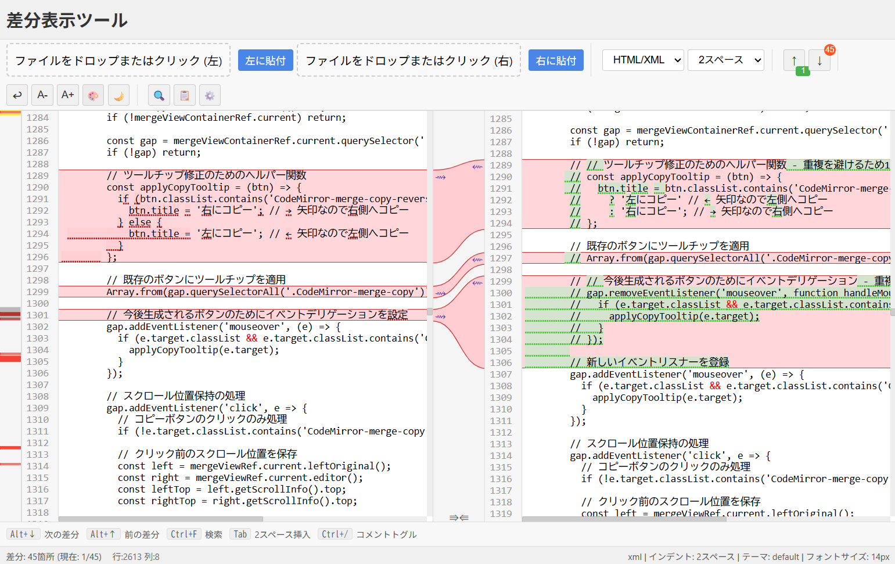

# 差分表示ツール

## 概要

この差分表示ツールは、コードや文書の違いを視覚的に比較するためのウェブアプリケーションです。2つのファイルを左右に表示し、追加・削除された部分を色分けして表示します。ミニマップ機能により全体の差分を俯瞰でき、簡単に差分箇所を行き来できます。

## 特徴

- **直感的なUI**: ドラッグ＆ドロップでファイルを読み込み、左右に並べて比較
- **リアルタイム差分ハイライト**: 追加（緑色）と削除（赤色）をわかりやすく色分け
- **ミニマップナビゲーション**: 全体の差分位置をミニマップで確認でき、クリックでジャンプ
- **キーボードショートカット**: Alt+↑/↓キーで差分間の移動など、効率的な操作
- **言語対応**: JavaScript、Python、HTML/XML、CSSに対応
- **カスタマイズ**: テーマ、フォントサイズ、インデントなどを好みに合わせて調整可能
- **ダークモード**: 目に優しいダークテーマに切り替え可能

## 使い方

1. **ファイルの読み込み**:
   - ファイルをドラッグ＆ドロップ
   - 「ファイルをドロップまたはクリック」をクリックしてファイル選択
   - クリップボードから「左に貼付」「右に貼付」ボタンでペースト

2. **差分の確認**:
   - 緑色の背景は追加された部分
   - 赤色の背景は削除された部分
   - 右側のミニマップで全体の差分位置を確認

3. **ナビゲーション**:
   - 「↑」「↓」ボタンまたは Alt+↑/↓ キーで差分間を移動
   - ミニマップをクリックして特定の差分にジャンプ
   - Ctrl+F で検索

4. **表示カスタマイズ**:
   - 「⚙️」ボタンから各種設定を変更
   - テーマ、フォントサイズ、行の折り返しなどを調整

## 技術的詳細

- React.jsを使用したインタラクティブなUI
- CodeMirror for マージビューと構文ハイライト
- diff_match_patchアルゴリズムによる差分検出
- ローカルストレージによる設定の保存

このツールはブラウザ上で動作するため、インストール不要で簡単に使用できます。テキストファイルは全てクライアントサイドで処理され、サーバーにアップロードされることはありません。