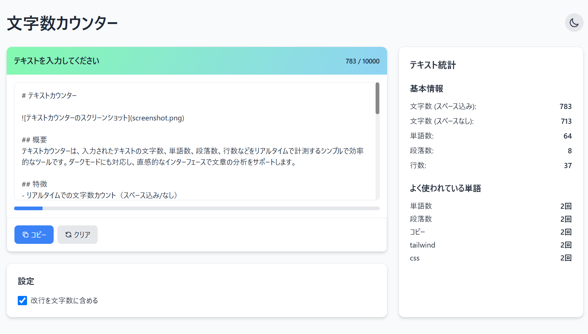

# テキストカウンター

## 概要
テキストカウンターは、入力されたテキストの文字数、単語数、段落数、行数などをリアルタイムで計測するシンプルで効率的なツールです。ダークモードにも対応し、直感的なインターフェースで文章の分析をサポートします。

## 特徴
- リアルタイムでの文字数カウント（スペース込み/なし）
- 単語数、段落数、行数の自動計算
- よく使われている単語のランキング表示
- ダークモード/ライトモード切り替え機能
- 改行を文字数に含めるかどうかのオプション設定
- コピー・クリア機能搭載
- レスポンシブデザイン対応

## 使い方
1. テキストエリアに文章を入力またはコピー＆ペーストします
2. 統計情報が自動的に更新され、文字数や単語数などが表示されます
3. 右上のアイコンでダークモード/ライトモードを切り替えられます
4. 「改行を文字数に含める」の設定を変更することで、カウント方法を調整できます
5. 「コピー」ボタンでテキストをクリップボードにコピー、「クリア」ボタンで入力をリセットできます

## 技術的な詳細
このアプリケーションは以下の技術を使用しています：
- HTML5
- CSS3 (Tailwind CSS)
- JavaScript (ES6+)
- CSS変数によるダークモード実装
- ローカルストレージを使用したテーマ設定の保存

## クレジット
- デザイン・開発: llm-100days-challenge プロジェクト（Day 50）
- フレームワーク: [Tailwind CSS](https://tailwindcss.com/)

## ライセンス
MITライセンスの下で公開されています。