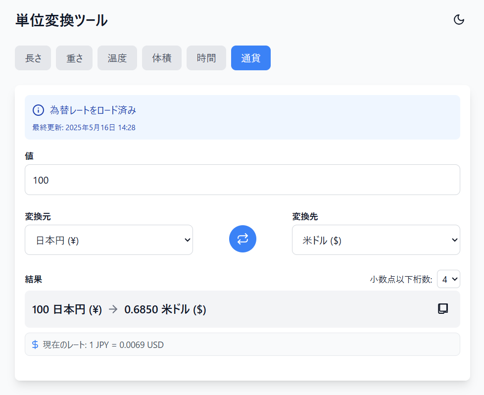

# 日常単位変換ツール

シンプルで使いやすい単位変換ツールです。長さ、重さ、温度、体積、時間に加えて、リアルタイムの通貨変換にも対応しています。スマートフォンやタブレット、デスクトップで快適に使用できるレスポンシブデザインを採用。オフライン環境でも使用可能です。

## 機能

- **多様な単位変換**：
  - 長さ（mm、cm、m、km、インチ、フィート、ヤード、マイルなど）
  - 重さ（mg、g、kg、トン、オンス、ポンドなど）
  - 温度（摂氏、華氏、ケルビン）
  - 体積（ml、l、立方メートル、ガロン、カップなど）
  - 時間（ミリ秒、秒、分、時間、日、週、月、年）
  - **通貨**（日本円、米ドル、ユーロ、英ポンドなど主要10通貨）

- **ユーザーフレンドリーな機能**：
  - リアルタイム変換（入力と同時に結果が更新される）
  - 結果のコピー機能（ワンクリックでクリップボードにコピー）
  - 小数点以下の桁数調整（0-6桁まで選択可能）
  - ダークモード対応（目に優しいダークテーマ）
  - 通貨レートの自動更新とキャッシュ機能

- **PWA機能**：
  - オフライン対応（インターネット接続なしでも使用可能）
  - インストール可能（ホーム画面に追加可能）
  - 高速な読み込み（サービスワーカーによるキャッシュ）

## 特徴

- **シンプルな設計**：余計な要素がない、直感的なUI
- **モバイルファースト**：スマートフォンでも使いやすいレイアウト
- **高速動作**：ブラウザ内で即時計算
- **最小限の依存関係**：CDN経由のライブラリのみで動作
- **単一ファイル構成**：index.htmlひとつで完結（+サービスワーカー）

## 技術仕様

- **HTMLとバニラJavaScript**：フレームワークに依存しない軽量設計
- **Tailwind CSS**：モダンでレスポンシブなデザイン
- **Math.js**：正確な単位変換計算
- **Frankfurter API**：APIキー不要の為替レート取得
- **ローカルストレージ**：設定と通貨レートのキャッシュ
- **サービスワーカー**：オフライン機能の実現

## 使い方

1. 上部のタブから変換したい単位のカテゴリを選択します（長さ、重さ、通貨など）
2. 変換したい値を入力します
3. 変換元と変換先の単位を選択します
4. 結果が自動的に表示されます
5. 小数点以下の桁数を調整できます
6. 必要に応じて、結果をコピーボタンでクリップボードにコピーできます

## デプロイ方法

このアプリケーションはGitHub Pagesで簡単に公開できます：

1. リポジトリをクローンします: `git clone https://github.com/yourusername/day051-unit-converter.git`
2. index.htmlとsw.jsをリポジトリ内に配置します
3. 変更をコミットし、GitHubにプッシュします
4. GitHub Pagesの設定でデプロイします

## 将来の拡張計画

- 追加の通貨対応
- お気に入り変換の保存と履歴機能
- カスタム単位の追加機能
- 単位間の比較グラフ表示
- PWA機能の強化

## プライバシーポリシー

- 本アプリはユーザーのデータをサーバーに送信しません
- 通貨変換のために外部API（Frankfurter API）を使用します
- 通貨レートはローカルストレージにのみ保存されます

## ライセンス

MIT

## 作成者

HIROE MATSUNO

## 謝辞

- [Math.js](https://mathjs.org/) - 単位変換のための優れたライブラリ
- [Tailwind CSS](https://tailwindcss.com/) - スタイリングの効率化
- [Frankfurter API](https://www.frankfurter.app/) - 通貨変換レート提供
- [Lucide Icons](https://lucide.dev/) - 美しいアイコン