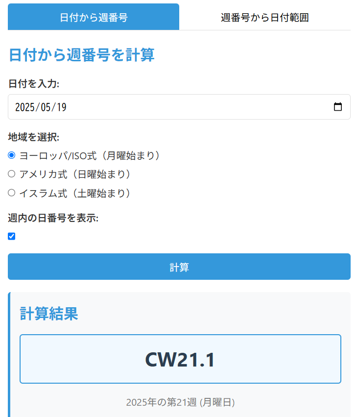

# 週番号計算ツール



## 概要

「週番号計算ツール」は、日付と週番号（カレンダーウィーク）の相互変換ができるWebアプリケーションです。3つの異なる週番号計算方式（ヨーロッパ/ISO式、アメリカ式、イスラム式）に対応しており、地域によって異なる週の定義に合わせた計算が可能です。

## 機能

### 日付から週番号を計算
- 入力された日付に対する週番号（CW）を表示
- 週内の日番号も表示可能（例：CW21.3）
- 週の開始日と終了日を表示

### 週番号から日付範囲を計算
- 入力された週番号と年から、その週の日付範囲を表示
- 週内の特定の日（1-7日目）も指定可能
- 特定の日を指定した場合、その日付を強調表示

### 対応している週番号方式
1. **ヨーロッパ/ISO式**
   - 週の開始日：月曜日
   - 第1週の定義：年の最初の木曜日を含む週（または1/4を含む週）

2. **アメリカ式**
   - 週の開始日：日曜日
   - 第1週の定義：1月1日を含む週

3. **イスラム式**
   - 週の開始日：土曜日
   - 第1週の定義：年の最初の金曜日を含む週

## 技術仕様

- **フロントエンドのみ**：HTML、CSS、JavaScript
- **依存ライブラリ**：Luxon.js（日付・時刻操作）
- **レスポンシブデザイン**：モバイルデバイスでも使いやすいUI
- **GitHub Pages対応**：静的ファイルのみで構成

## 使い方

### 日付から週番号を調べる
1. 「日付から週番号」タブを選択
2. 日付を入力
3. 地域（週計算方式）を選択
4. 「週内の日番号を表示」にチェックを入れると、週の何日目かも表示
5. 「計算」ボタンをクリック

### 週番号から日付範囲を調べる
1. 「週番号から日付範囲」タブを選択
2. 週番号（1〜53）を入力
3. 年を入力
4. 必要に応じて週内の日番号（1〜7）を入力
5. 地域（週計算方式）を選択
6. 「計算」ボタンをクリック

## インストール方法

GitHubリポジトリからクローンするか、ZIPファイルとしてダウンロードして、Webサーバーにアップロードするだけです。依存ライブラリはCDNから読み込まれるため、追加のインストール作業は不要です。

```bash
git clone https://github.com/yourusername/day053-week-number-calculator.git
cd day053-week-number-calculator
# そのまま開くかサーバーにデプロイ
```

## 開発背景

異なる地域や業界で使用される週番号の計算方法は多様です。特に国際的なプロジェクト管理やスケジュール調整において、地域間の週番号の違いは混乱を招くことがあります。このツールは、異なる週番号計算方式を簡単に相互変換できるようにすることで、そうした問題を解決します。

## ライセンス

MIT License

## 作者

このアプリケーションは、LLM-100日チャレンジの第53日目のプロジェクトとして作成されました。