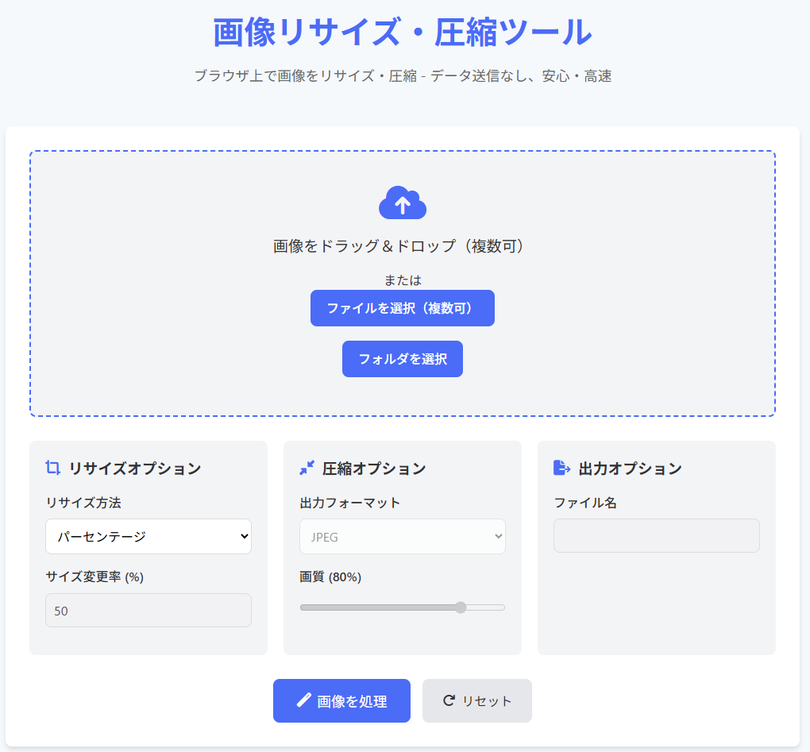

# 画像リサイズ・圧縮ツール

ブラウザ上で動作する高速で使いやすい画像処理ツールです。JPEG・PNG画像のリサイズと圧縮をクライアントサイドで行い、データをサーバーに送信することなく、プライバシーを守りながら効率的に画像を最適化できます。

## 機能

- **画像のリサイズ**：幅/高さ指定またはパーセンテージでのリサイズが可能
- **画像の圧縮**：JPEGの画質調整やPNG最適化でファイルサイズを削減
- **複数ファイル処理**：単一ファイルだけでなく、複数ファイルのバッチ処理に対応
- **フォルダ処理**：フォルダ内の画像をまとめて処理
- **プレビュー機能**：処理前後の画像を比較表示
- **ドラッグ＆ドロップ対応**：直感的なファイル選択が可能
- **縦横比維持**：リサイズ時のアスペクト比を保持
- **出力フォーマット選択**：JPEG/PNGの選択が可能
- **一括ダウンロード**：処理した複数画像をZIPファイルでダウンロード

## 使い方

1. 画像ファイルを選択（ドラッグ＆ドロップまたはファイル選択ボタンから）
2. リサイズ方法と出力設定を選択
   - サイズ指定（幅/高さ）またはパーセンテージでのリサイズ
   - 出力フォーマット（JPEG/PNG）の選択
   - JPEGの場合は画質設定（0-100%）
3. 「画像を処理」ボタンをクリック
4. 処理結果を確認し、「ダウンロード」ボタンで保存

## 特徴

- **クライアントサイド処理**：すべての処理がブラウザ上で行われ、画像データが外部に送信されることはありません
- **高速処理**：最新のJavaScript APIを使用した効率的な処理
- **モバイル対応**：レスポンシブデザインで様々なデバイスに対応
- **視覚的フィードバック**：処理中の表示や圧縮率の視覚的な表示で使いやすさを向上
- **バッチ処理機能**：複数の画像を一度に効率よく処理

## 技術的詳細

- 純粋なHTML/CSS/JavaScriptで実装
- Canvas APIを使用した画像処理
- FileReader APIとBlob URLによるファイル操作
- JSZipライブラリを使用したZIPファイル生成
- Font Awesomeによるアイコン表示
- CSS Grid/Flexboxを活用したレスポンシブレイアウト

## プライバシーと安全性

このツールはブラウザ上で完結し、画像データをサーバーに送信することはありません。そのため、機密性の高い画像も安心して処理できます。

---

LLM 100日チャレンジ - Day 055