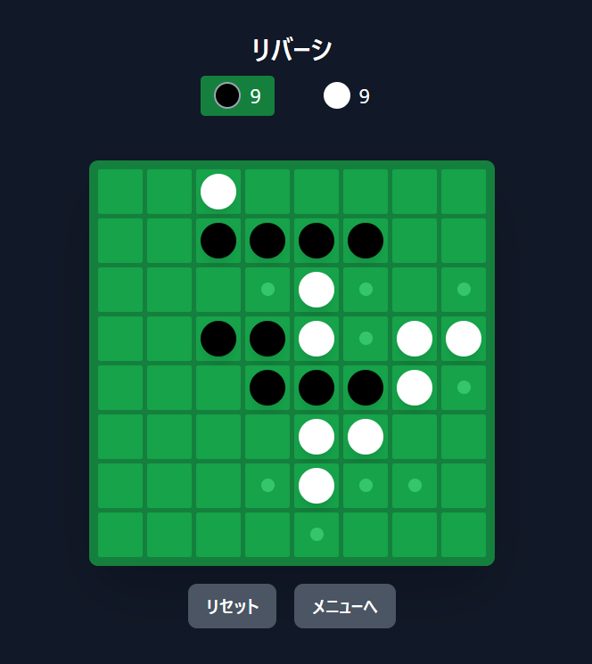

# リバーシ - CPU対戦対応ボードゲーム

ブラウザで遊べるリバーシ（白黒ゲーム）です。2人対戦とCPU対戦に対応しています。

## デモ

🎮 [プレイする](https://hiroe28.github.io/llm-100days-challenge/day063-reversi/index.html)



## 機能

### ゲームモード

- **👥 2人対戦**: 同じ画面で交互にプレイ
- **🤖 CPU対戦**: 先攻・後攻を選択可能

### CPU強さ 3段階

| レベル | 説明 | アルゴリズム |
|--------|------|-------------|
| 弱い | 初心者向け | ランダム選択 |
| 普通 | 中級者向け | 位置評価 + ランダム要素 |
| 強い | 上級者向け | ミニマックス法（4手先読み）+ αβ枝刈り |

### ゲーム機能

- ✅ 置ける場所を緑の点で表示
- ✅ 現在のターンをハイライト表示
- ✅ スコアのリアルタイム表示
- ✅ パスの自動判定と通知
- ✅ 勝敗判定

## 技術仕様

### 使用技術

- React 18
- Tailwind CSS
- Babel（ブラウザ内トランスパイル）

### AIアルゴリズム

**位置評価テーブル**

角（コーナー）を最高評価（+100）、角の隣を低評価（-20〜-50）として、盤面の位置ごとに重み付けを行います。

```
[100,-20, 10,  5,  5, 10,-20,100]
[-20,-50, -2, -2, -2, -2,-50,-20]
[ 10, -2, -1, -1, -1, -1, -2, 10]
[  5, -2, -1, -1, -1, -1, -2,  5]
[  5, -2, -1, -1, -1, -1, -2,  5]
[ 10, -2, -1, -1, -1, -1, -2, 10]
[-20,-50, -2, -2, -2, -2,-50,-20]
[100,-20, 10,  5,  5, 10,-20,100]
```

**ミニマックス法**

「強い」モードでは、4手先まで読んで最善手を探索します。αβ枝刈りにより探索効率を向上させています。

## ファイル構成

```
day063-reversi/
├── index.html    # メインファイル（HTML/CSS/JS一体型）
├── README.md     # このファイル
└── screenshot.png # スクリーンショット
```

## ローカルでの実行

```bash
# リポジトリをクローン
git clone https://github.com/hiroe28/llm-100days-challenge.git

# フォルダに移動
cd llm-100days-challenge/day063-reversi

# ローカルサーバーで起動（Python 3の場合）
python -m http.server 8000

# ブラウザで開く
# http://localhost:8000
```

## ゲームのルール

1. 黒が先手で交互に石を置きます
2. 相手の石を自分の石で挟むと、挟まれた石がひっくり返ります
3. 縦・横・斜めのいずれの方向でも挟めます
4. 石を置ける場所がない場合はパスになります
5. 両者とも置けなくなったらゲーム終了
6. 石の多い方が勝ちです

## ライセンス

MIT License

## 作者

Hiroe