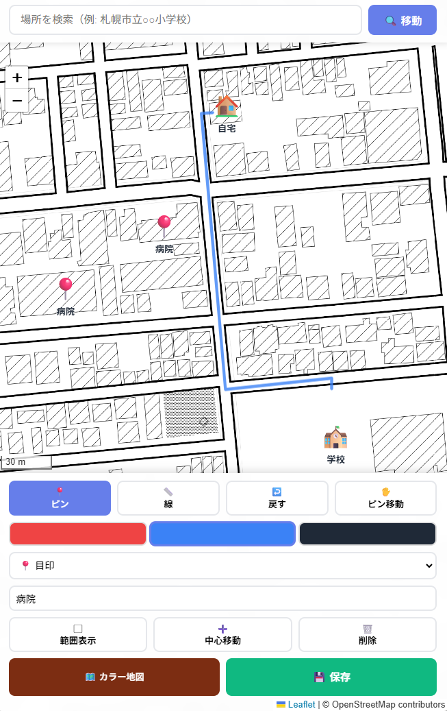

# 📍 通学路地図作成ツール

小学校提出用の通学路地図を簡単に作成できるWebアプリケーション。スマホでも使いやすい設計で、APIキー不要で完全無料で利用できます。

## ✨ 主な機能

### 🎯 2点ピン方式
- **簡単操作**: 自宅と学校など、2箇所以上にピンを配置するだけ
- **自動範囲計算**: 配置したピンを含む範囲を自動で算出
- **固定縮尺**: ズームレベル18（約60m縮尺）で道路が白く見える状態で保存

### 📱 スマホ最適化
- **レスポンシブデザイン**: スマホ・タブレット・PCで快適に動作
- **タッチ操作対応**: 画面の小さいスマホでも簡単にピン配置
- **縦レイアウト**: スマホでは地図が上、操作パネルが下に配置

### 🗺️ 地図スタイル
- **白黒地図（濃いめ）**: デフォルト設定、印刷に最適
- **白黒地図（明るめ）**: 明るいトーンの白黒地図
- **カラー地図**: 通常のOpenStreetMap
- **ラベル表示/非表示**: 初期は非表示、必要に応じて切り替え可能

### 🎨 カスタマイズ機能
- **明るさ・コントラスト調整**: スライダーで細かく調整可能
- **ピン種類**: 🏠自宅、🏫学校、📍その他の3種類
- **ピン表示/非表示**: 保存前に切り替えて地図のみ保存も可能

### 💾 保存機能
- **複数の画像サイズ**: 800×600から2000×1500まで選択可能
- **PNG形式**: 高品質な画像として保存
- **日付付きファイル名**: 自動で日付が付与される

## 🚀 使い方

### 基本的な手順

1. **場所を検索**
   - 住所入力欄に「札幌市中央区北3条西6丁目」などと入力
   - 🔍検索ボタンをタップして目的地へ移動

2. **ピンを配置**
   - ピンの種類を選択（🏠自宅、🏫学校、📍その他）
   - 「➕ 地図タップでピン追加」をタップ
   - 地図上で自宅・学校などをタップしてピンを配置（2個以上必要）

3. **保存設定**
   - 画像サイズを選択（推奨：1200×900）
   - ピンを印刷したくない場合は「ピン非表示」をタップ

4. **画像保存**
   - 「💾 ピンの範囲を画像保存」をタップ
   - 自動で範囲が計算され、ズーム18で画像が生成されます
   - ダウンロードされた画像をExcelなどで開いて経路を追加

### 💡 便利なTips

- **ピンの削除**: 「🗑️ ピンを全削除」で一括削除
- **地図調整**: 保存前にズーム・位置を調整しても、保存時は自動で最適化されます
- **ラベル非表示**: デフォルトで非表示、見やすさ重視
- **詳細設定**: 明るさ・コントラストは折りたたみメニュー内

## 🛠️ 技術仕様

### 使用技術
- **Leaflet.js 1.9.4**: オープンソースの地図ライブラリ
- **OpenStreetMap**: 無料の地図データ
- **CartoDB Positron / Stamen Toner**: 白黒地図タイル
- **html2canvas**: 地図の画像化
- **Nominatim API**: 住所検索（無料）

### 対応ブラウザ
- Chrome / Edge（推奨）
- Safari
- Firefox
- モバイルブラウザ（iOS Safari, Android Chrome）

### ネットワーク要件
- インターネット接続が必要（地図タイルの読み込みのため）
- APIキー不要
- 完全無料

## 📐 仕様詳細

### ズームレベル
- **初期表示**: ズーム18（約60m縮尺）
- **住所検索後**: ズーム18
- **保存時**: ズーム18固定

### 範囲計算
- 配置した全ピンを含むバウンディングボックスを計算
- 10%の余白を自動付加
- ピンがギリギリにならないよう配慮

### 画像サイズ
- 800×600px
- 1200×900px（推奨）
- 1600×1200px
- 2000×1500px（高解像度）

## 🎓 活用シーン

- **小学校入学**: 通学路地図の提出用
- **転校時**: 新しい通学路の確認・提出
- **学童保育**: お迎えルートの説明
- **保護者会**: 通学路の共有・議論
- **防災マップ**: 避難経路の作成

## 📝 ライセンス

このツールはオープンソースで提供されています。

### 地図データ
- © OpenStreetMap contributors
- © CARTO（Positron地図）
- © Stadia Maps（Toner地図）

## 🙏 謝辞

- [Leaflet.js](https://leafletjs.com/) - 地図ライブラリ
- [OpenStreetMap](https://www.openstreetmap.org/) - 地図データ
- [html2canvas](https://html2canvas.hertzen.com/) - スクリーンショット機能

## 📮 フィードバック

改善提案やバグ報告は、GitHubのIssuesまでお願いします。

---

**Day 65 - LLM 100 Days Challenge**  
Created with Claude (Anthropic)
